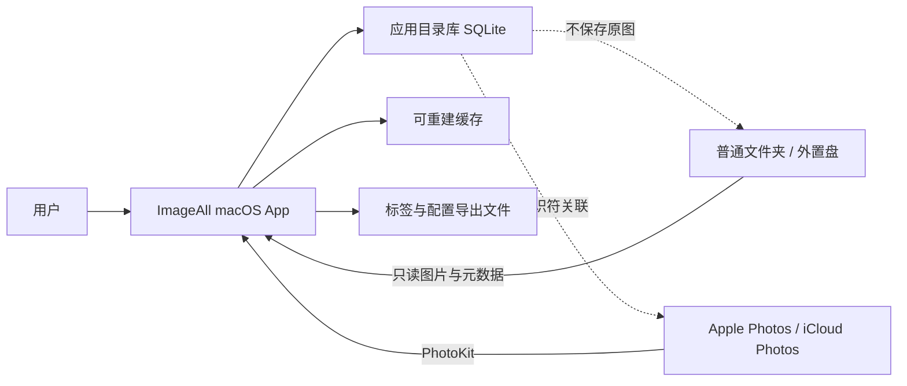
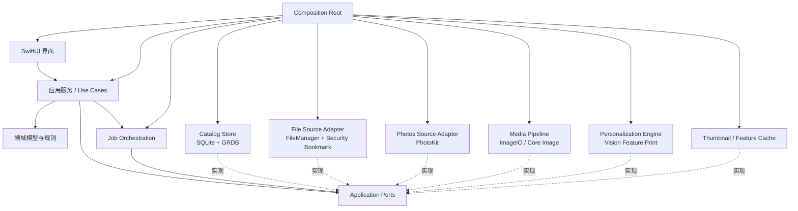

# ImageAll 架构设计

> 状态：Draft v0.2<br>
> 日期：2026-07-14<br>
> 目标读者：产品开发者、后续参与实现与评审的工程师<br>
> 决策范围：首个可用版本（MVP）及其可演进边界

## 1. 摘要

ImageAll 是一款本地优先的原生 macOS 图片管理与个性化多标签应用。它统一索引两类资产：

1. 用户选择的普通文件夹，包括外置磁盘上的多 TB 图片档案；
2. 当前 Mac 的 Apple Photos 照片库。

应用不搬运、不修改原图。它在自己的 SQLite 目录库中保存资产索引、自定义标签、人工确认/拒绝记录、视觉特征版本和模型预测。用户先手工标注少量正例与反例，应用再为其余图片给出可确认的标签建议；人工标签永远优先，预测不得覆盖人工决定。

MVP 的核心闭环是：

```text
添加图片来源 → 建立可恢复索引 → 手工打标签
→ 基于正负样本生成建议 → 用户确认或拒绝
→ 更新标签模型 → 继续生成更好的建议
```

首版不做云端服务、不写回 Apple Photos 关键词、不训练端到端神经网络，也不提供删除或移动原图的能力。

## 2. 背景与问题定义

现有照片管理工具通常能提供“用户手工标签”或“固定通用 AI 标签”，但不能让用户用少量正负样本定义任意个人标签，并持续改进预测。ImageAll 要解决的是个性化多标签分类，而不是传统的互斥多分类。

一张图片可以同时具有多个标签，例如：

- `家人`
- `需要修图`
- `适合打印`
- `工作参考`
- `票据`

这些标签中，一部分能从画面判断，一部分依赖个人偏好。系统因此必须把模型输出定义为“建议”，并把用户反馈作为一等数据，而不能把通用模型输出当作事实。

用户拥有数 TB 图片，因此架构必须满足以下前提：

- 文件夹是大规模原始档案的主要来源；
- Apple Photos 是另一个受支持的数据源，而不是文件路径；
- 初次索引可耗时，但必须可暂停、可恢复；
- 后续只处理新增或变化的资产；
- 内存使用不能随全部资产数量线性增长；
- 原图不可复制进应用目录作为长期存储。

## 3. 目标与非目标

### 3.1 MVP 目标

- 原生 macOS 浏览与标签界面；
- 添加、停用和重新授权文件夹来源；
- 读取 Apple Photos 图片资产；
- 统一浏览、筛选和搜索两个来源的图片；
- 创建、重命名、归档自定义标签；
- 单张或批量添加人工标签；
- 明确记录正例、反例和未判断状态；
- 从少量正负样本产生本地标签建议；
- 显示建议强度或排序，并支持接受或拒绝；
- 后台增量索引、失败重试和进度展示；
- 导出不可重建的用户数据。

### 3.2 明确非目标

- 不托管或同步原图；
- 不依赖账号、服务器或互联网才能使用；
- 不修改、移动或删除来源中的原图；
- 不直接读取 `.photoslibrary` 包内部文件；
- 不向 Apple Photos 写入任意关键词；
- 不在 MVP 中实现 iPhone/iPad 客户端；
- 不在 MVP 中实现人脸身份识别、OCR、GPS 语义或相册关系推理；
- 不在 MVP 中自动合并或删除重复图片；
- 不把 NAS、SMB/NFS 目录或其他网络文件系统作为受支持的 MVP 来源；
- 不在 MVP 中自动导入或恢复可移植导出；导出格式先保证可检查和可演进；
- 不在 MVP 中训练或微调整个视觉神经网络；
- 不把预测标签自动当成人工确认标签。

## 4. 架构原则

1. **原图只读**：任何索引、分析或导出失败都不能损坏用户资产。
2. **用户决定优先**：人工接受和人工拒绝均是持久事实，模型不得覆盖。
3. **来源无关**：领域层不依赖文件路径或 `PHAsset`；来源差异留在适配层。
4. **派生数据可重建**：缩略图、视觉特征和预测都可以删除后重新生成。
5. **增量优先**：昂贵的解码、特征和预测只处理新增或变化资产；来源发现可以采用流式全量对账。
6. **任务可恢复**：耗时工作以小批次提交进度，应用退出后可以续跑。
7. **版本显式**：视觉特征、分类器、阈值和预测都携带版本。
8. **首版简单**：一个 App target、一个单元测试 target；先用目录分层，不提前拆多个 Swift Package。

## 5. 系统上下文



应用维护的是“目录库”，不是新的照片库：

- 文件资产通过来源根目录与相对路径定位，并用资源标识符和内容指纹判定身份；
- Photos 资产通过 `PHAsset.localIdentifier` 定位；
- 两种资产都映射成统一的 `Asset`；
- 原图留在原来源，应用只保存元数据和派生数据。

## 6. 总体架构



箭头表示编译期依赖。应用服务和任务编排只依赖 Application Ports；基础设施实现反向依赖这些 Ports。Composition Root 是唯一同时认识抽象与具体实现的地方，负责构造并注入对象。

### 6.1 表现层

采用 SwiftUI，必要时用 AppKit 包装 macOS 特有能力，例如目录选择、菜单、快捷键和高级拖放。界面只调用应用服务，不直接操作 PhotoKit、文件系统或数据库。

主要页面：

- 来源管理；
- 图片网格与详情；
- 标签管理；
- 待确认建议；
- 后台任务与错误；
- 数据导出和修复。

### 6.2 应用服务层

每个用户动作对应一个明确用例：

- `AddFolderSource`
- `ConnectPhotosLibrary`
- `ScanSource`
- `CreateTag`
- `ApplyManualTag`
- `RejectTag`
- `GenerateSuggestions`
- `AcceptSuggestion`
- `ExportUserData`

应用服务负责事务边界和任务编排，不包含图像算法细节。

### 6.3 领域层

领域层保存不依赖框架的核心规则：

- 一个资产可拥有多个标签；
- 同一资产和标签只能有一个最终人工判断；
- `accepted` 与 `rejected` 互斥；
- 模型预测不能覆盖人工判断；
- 标签归档后停止产生新建议，但保留历史关系；
- 资产暂时不可访问时标记为 `unavailable`，不删除其标签；
- 资产内容发生变化时，仅使派生数据失效，人工标签仍保留并提示复核。

### 6.4 基础设施层

- PhotoKit：获取 Photos 元数据、缩略图和变化历史；
- FileManager / URL：枚举用户授权目录；
- security-scoped bookmark：跨启动恢复目录只读权限；
- ImageIO / Core Image：解码、方向校正和缩放；
- Vision：生成首版视觉 Feature Print；
- SQLite + GRDB：目录库、事务、迁移、索引和查询；
- Swift Concurrency：受控并发、取消和后台流水线。

## 7. 代码组织

MVP 保持单工程、单 App target，按职责使用目录边界：

```text
ImageAll/
├── App/
│   └── CompositionRoot/
├── Application/
│   ├── UseCases/
│   ├── Ports/
│   └── Jobs/
├── Features/
│   ├── Library/
│   ├── Tags/
│   ├── Suggestions/
│   ├── Sources/
│   └── Settings/
├── Domain/
│   ├── Models/
│   └── Rules/
├── Infrastructure/
│   ├── Database/
│   ├── FileSource/
│   ├── PhotosSource/
│   ├── Media/
│   ├── Personalization/
│   └── JobQueue/
└── Resources/

ImageAllTests/
├── Domain/
├── Database/
├── Sources/
└── Personalization/
```

只有在出现独立发布、显著编译时间或复用需求时，才把目录拆成 Swift Package。

## 8. 统一资产模型

### 8.1 资产标识

应用使用内部不可变 UUID `asset_id`。来源定位信息单独保存：

```swift
enum AssetLocator: Codable, Sendable {
    case file(relativePath: String)
    case photos(localIdentifier: String)
}
```

不把绝对路径当作长期身份。文件来源的根目录由 security-scoped bookmark 定位，单个资产只保存相对路径。路径是定位信息，不等于资产身份。MVP 使用以下保守规则：

1. 同一路径且资源标识符未变：视为同一资产；大小或修改时间变化时增加 content revision，保留人工标签并提示复核；
2. 同一路径但资源标识符已变，或原文件曾缺失后出现另一文件：创建新 `asset_id`，旧资产保持不可用，新资产不继承旧标签；
3. 文件在同一来源内移动：只有稳定资源标识符匹配，或唯一 SHA-256 匹配时，才把新路径重新绑定到原 `asset_id`；
4. 多个候选命中、指纹不足或文件系统不提供稳定资源标识符时，不自动合并，等待用户确认；
5. SHA-256 只按需计算，用于歧义消解和去重，不作为首次扫描的必需成本。

该规则优先避免把旧标签错误赋给新图片，即使代价是少数移动文件需要人工重新关联。

一个 Asset 明确表示“一个 Source 中的一次可定位出现”，不是跨来源去重后的逻辑图片。同一字节如果出现在两个 Source 中，就产生两个 `asset_id`；MVP 拒绝添加互相包含的文件夹根目录，避免因重叠 Source 重复索引。同一 Source 内的硬链接按不同相对路径视为不同 Asset；resource identifier 只有在“旧路径消失且新路径唯一命中”时才能用于移动重连。自动去重与跨来源合并不属于 MVP。

Photos 的 `localIdentifier` 只在当前本地照片库上下文中使用。跨设备标签同步不属于 MVP；若以后增加该能力，再引入 `PHCloudIdentifier`。

### 8.2 数据状态分离

每个资产与标签之间必须区分三类信息：

| 类型 | 含义 | 是否可被模型覆盖 |
|---|---|---:|
| `manualAccepted` | 用户确认属于该标签 | 否 |
| `manualRejected` | 用户确认不属于该标签 | 否 |
| `suggested` | 某版本模型给出的建议 | 是，可重新计算 |

“未标注”不是负例。只有显式拒绝或用户指定的负样本才进入负例集合。

## 9. 数据持久化设计

### 9.1 存储选择

选择 SQLite + GRDB，而不是把目录库建立在 SwiftData 上。原因是该应用需要显式 schema、批量 upsert、复合索引、可控迁移、后台写入和百万级元数据查询。GRDB 保留标准 SQLite 文件的可检查性，同时提供 Swift 接口、迁移、观察和并发支持。

首个目录库的六张业务表使用 SQLite `STRICT` table，使 TEXT / INTEGER / BLOB 数据字典成为真实写入约束，并让完整性检查覆盖列类型；GRDB 自有 migration 表除外。以后每个新增业务表仍默认采用 STRICT，若需要 SQLite 动态类型必须单独记录理由。

数据库位于应用的 Application Support 容器。缩略图和视觉特征放入独立 Cache 目录，避免数据库备份被可重建二进制数据放大。

### 9.2 逻辑表

| 表 | 关键字段 | 职责 |
|---|---|---|
| `source` | `id`, `kind`, `display_name`, `bookmark`, `sync_cursor`, `scan_generation`, `dirty_epoch`, `state` | 文件夹或 Photos 来源 |
| `asset` | `id`, `source_id`, `locator`, `locator_state`, `media_type`, `width`, `height`, `created_at`, `modified_at`, `content_revision`, `last_seen_generation`, `availability` | 统一资产元数据；当前定位与来源可用性分离 |
| `file_fingerprint` | `asset_id`, `size`, `mtime`, `resource_id`, `sha256` | 文件变化和移动检测 |
| `tag` | `id`, `name`, `normalized_name`, `state`, `created_at` | 用户标签定义 |
| `asset_tag_decision` | `asset_id`, `tag_id`, `decision`, `updated_at` | 用户接受或拒绝的事实 |
| `feature` | `asset_id`, `provider`, `revision`, `content_revision`, `cache_key` | 视觉特征索引 |
| `tag_model` | `tag_id`, `current_revision` | 每标签当前模型指针 |
| `tag_model_revision` | `tag_id`, `revision`, `provider`, `threshold`, `metrics`, `selection_policy`, `created_at` | 不可变的每标签模型版本 |
| `tag_model_sample` | `tag_id`, `model_revision`, `asset_id`, `content_revision`, `role`, `rank` | 可复现的正负代表样本集合 |
| `evaluation_assignment` | `asset_id`, `tag_id`, `cohort_id`, `split`, `content_hash` | 稳定的训练/验证/测试归属 |
| `prediction` | `asset_id`, `tag_id`, `content_revision`, `model_revision`, `score`, `state`, `created_at` | 可丢弃的建议 |
| `job` | `id`, `kind`, `payload_version`, `payload`, `source_id`, `checkpoint_version`, `checkpoint`, `scan_generation`, `started_dirty_epoch`, `state`, `control_request`, `priority`, `attempts`, `lease`, `last_error` | 可恢复后台任务 |

关键约束：

- `tag.normalized_name` 唯一；
- `asset_tag_decision(asset_id, tag_id)` 唯一；
- `prediction(asset_id, tag_id, content_revision, model_revision)` 唯一；
- `feature(asset_id, provider, revision, content_revision)` 唯一；
- `tag_model_revision(tag_id, revision)` 唯一，`tag_model_sample(tag_id, model_revision, asset_id)` 唯一；`tag_model(tag_id, current_revision)` 必须引用已存在的 revision；
- 每个 Source 内同一 locator 只能有一个 `locator_state = current` 的 Asset；Source 离线或 Asset 缺失不释放当前 locator，只有确认路径复用或移动重连时才在事务内变更绑定；
- 删除标签默认采用归档，不级联删除人工历史；
- 移除来源默认只停用 Source，保留 Asset、人工决定和派生数据；永久清除必须再次确认，并先提供可移植导出。永久清除后才允许删除该 Source 的 Asset、人工决定和缓存。

### 9.3 真相与缓存

不可重建、必须纳入应用内部操作快照：

- 来源定义和授权书签；
- 自定义标签；
- 人工接受与拒绝；
- 用户配置的阈值；
- 必要的模型训练元数据。

内部操作快照用于数据库迁移失败或同一 Mac 上的恢复，可以包含 security-scoped bookmark。它不同于可移植用户导出。

内部快照使用 SQLite online backup API 从一致性读视图生成：先写入 `Backups/<snapshot-id>.tmp/` 中的数据库文件，执行 `PRAGMA quick_check` 并生成带 schema version 与校验和的 manifest，再把整个临时目录原子重命名为 `Backups/<snapshot-id>/`。每次 schema migration 前必须生成一份；事实数据发生变化时每天至多生成一份，并至少保留最近三份成功快照。恢复时关闭当前数据库、保留故障副本、校验快照后再替换，绝不在失败后静默创建空库。快照与主库在同一设备上，只防操作或迁移故障，不构成磁盘灾难备份；用户仍需把可移植导出纳入外部备份。

可移植用户导出必须带 schema version，并包含来源的稳定内部 ID、种类和显示名，文件相对路径与已有指纹、标签、人工决定、用户阈值和必要训练元数据。它不导出 security-scoped bookmark。MVP 只生成并校验导出，不实现自动导入；未来恢复工具必须要求用户重新授权来源。Photos 的 local identifier 只能用于同一照片库的最佳努力重连，不能承诺跨设备恢复。

可重建、允许清空：

- 缩略图；
- 视觉特征；
- 预测；
- 扫描统计和临时任务日志。

所有数据库外派生文件都遵循 `临时文件 → 完整写入 → 校验 → 原子重命名 → 数据库提交引用`。崩溃可能留下未被数据库引用的孤儿文件，但不能留下指向半文件的事实记录；启动后的低优先级清理任务回收孤儿文件。

## 10. 资产来源适配

### 10.1 文件夹来源

用户通过系统目录选择器授权一个根目录。应用创建只读的 app-scoped security-scoped bookmark，并在每次访问期间成对调用 `startAccessingSecurityScopedResource()` 与 `stopAccessingSecurityScopedResource()`。

扫描规则：

- 递归枚举，不一次性把全部 URL 读入内存；
- 只处理普通文件；默认不跟随符号链接或 Finder alias，不进入任何 package descendants，并无条件跳过 `.photoslibrary`；
- 只读取支持的图片 UTI；
- 忽略应用缓存、隐藏系统目录和明确配置的排除项；
- 以小批次写入数据库；
- 首次只采集低成本元数据，不立即计算所有 SHA-256；
- 目录离线或外置盘拔出时暂停任务，并保留持久化目录工作队列；
- 每次对账创建新的 `scan_generation`，流式枚举目录并标记本轮已见资产；
- 只有完整 generation 成功结束后，才把本轮未见资产标记为不可用；中断扫描不得据此判定删除；
- 每个批次的 Asset upsert、`last_seen_generation` 和 Job checkpoint 在同一 SQLite 事务提交；崩溃后允许从头重跑同一 generation，依靠唯一约束实现 at-least-once 幂等；
- 通过快速指纹比较后，只有新增或变化资产进入缩略图、特征和预测流水线；
- FSEvents 在 MVP 只用于合并并触发新的对账，不直接翻译成资产事实；应用启动、用户手动刷新和事件日志重置也会触发对账。每次文件事件在数据库事务中递增 Source 的 `dirty_epoch`。Job 启动时捕获 `started_dirty_epoch`；完成 generation 时只有两者仍相等才可标记 clean，否则必须先持久化下一次对账 Job，不能用当前扫描完成状态覆盖扫描期间到达的新事件。

因此，MVP 的“增量”指避免对未变化资产重复执行昂贵处理，而不是完全跳过目录命名空间枚举。扫描期间发生的并发变化允许在下一次对账收敛。

文件在解码或生成特征前后各读取一次大小、修改时间和 resource identifier；若两次结果不一致，本次派生结果丢弃并重新排队。resource identifier 变化必须先执行第 8.1 节的身份判定：默认创建新 Asset，不能仅给旧 Asset 增加 Revision。只有身份仍确认是同一 Asset 时，大小、修改时间或已存在的内容指纹变化才递增 `content_revision`。普通对账无法发现“内容被替换但大小、mtime 和 resource identifier 全部被刻意保持”的情况；MVP 将此记录为已知限制，并提供显式“深度验证来源”任务按需计算 SHA-256。

MVP 支持的格式以 ImageIO 能稳定解码的静态图片为准，具体清单在实现阶段通过运行时能力测试冻结。RAW、Live Photo 和视频不进入首个分类闭环。

### 10.2 Apple Photos 来源

Photos 适配器只使用 PhotoKit，不遍历 `.photoslibrary` 包。它负责：

- 请求照片库读取授权；
- 枚举图片 `PHAsset` 元数据；
- 通过 `PHCachingImageManager` 获取列表缩略图；
- 请求适合视觉分析的缩放图，而不是默认下载原图；
- 保存并消费 persistent change token；
- token 失效或变化记录不完整时执行可恢复的全量校验。

首次同步在枚举前保存起始 `PHPersistentChangeToken`，完成全量枚举后重放该 token 之后的变化，再发布“同步完成”状态。变化批次、对应 Asset 事实和新 token 在同一 SQLite 事务提交；若崩溃，旧 token 会导致安全重放，唯一约束保证幂等。全量校验同样使用 generation，只有完整枚举并完成增量重放后，才允许把未见 Photos Asset 标为源端删除。

PhotoKit 报告资产更新，或其 `modificationDate`、像素尺寸、媒体子类型等参与指纹的字段变化时，递增 `content_revision` 并使派生数据失效。照片库暂时不可用、系统库切换和权限撤销分别记录为 `libraryUnavailable`、`sourceChanged` 与 `unauthorized`，任何一种都不能被解释为批量删除。

若最终最低 macOS 版本不支持所需的 persistent change history，回退为应用运行期间的 PhotoKit change observer 加周期性全量元数据对账；该版本决定必须在阶段 2 开始前写入 ADR-008。

部分资产可能只有 iCloud 副本。默认索引元数据，但不自动触发大规模下载。Photos Adapter 是唯一可以构造 `PHImageRequestOptions` 的模块，所有网格预取、详情、特征和分析图片请求默认使用本地限定策略。用户显式启动云下载任务后，应用服务才签发作用于该 Job 的不透明 `CloudDownloadGrant`；Adapter 只有收到有效 grant 才把 `isNetworkAccessAllowed` 设为 `true`。调用方不能通过裸 `Bool` 绕过该策略，并且任务必须可取消、可计量、可测试。

iCloud 分析状态明确区分：`waitingForPermission`、`queued`、`downloading`、`retryableNetworkFailure` 和 `unavailable`。这些是某次内容请求的状态，不是永久的 Asset 属性。未授权网络访问的资产停留在 `waitingForPermission`，不得进入自动失败重试。用户关闭开关时撤销 grant 并取消未完成请求；已生成的分析尺寸缓存可以保留，但受统一缓存配额和淘汰策略约束。

原生 macOS 当前 SDK 将 `PHAuthorizationStatusLimited` 标为 iOS-only，因此 MVP 不假设持续 Photos Source 存在“受限照片库”授权。`PhotosPicker` 的 `Transferable` 选择结果也不作为可持续增量索引的 Locator。若未来要支持只选少量 Photos 资产并跨启动保留，必须先单独验证标识和数据保留契约。

### 10.3 统一来源协议

```swift
protocol AssetSource: Sendable {
    func reconcile(from checkpoint: SourceCheckpoint?) -> AsyncThrowingStream<AssetChange, Error>
    func metadata(for locator: AssetLocator) async throws -> AssetMetadata
    func preview(for locator: AssetLocator, request: PreviewRequest) async throws -> CGImage
}
```

`PreviewRequest` 默认只允许本地内容；只有应用服务可以附加不透明的 `CloudDownloadGrant`。应用与领域核心只认识 `AssetChange`、`AssetMetadata`、`AssetLocator` 和授权能力，不认识 `URL`、`PHAsset` 或 `PHImageRequestOptions`。

## 11. 图片处理与个性化学习

### 11.1 处理流水线


每个阶段独立幂等。任一阶段失败只记录当前资产和阶段，不回滚已完成的其他资产。

### 11.2 MVP 算法

首版采用 Vision `VNGenerateImageFeaturePrintRequest` 提取视觉特征，并用每个标签的少量正负样本执行距离型分类。选择它是为了先验证产品闭环，不引入模型下载、Python 环境或训练服务。

每标签评分的最小实现：

1. 收集该标签的人工正例和显式反例；
2. 计算待分类资产到正例、反例的 Feature Print 距离；
3. 分别取最近若干样本的稳健平均距离；
4. 根据正负距离差得到排序分数；
5. 只有达到最低样本量和阈值时才显示建议；
6. 用户的接受/拒绝生成新训练版本，并使旧建议失效。

MVP 不把分数宣传为统计意义上的概率。界面只使用排序或“高/中/低”建议强度；只有完成独立校准后才能显示百分比或“置信概率”。

为控制计算量，MVP 为每个标签设置固定的正负代表样本预算，具体上限和选择策略由阶段 3 原型冻结并写入 `tag_model_revision`。实际选中的 Asset、对应 `content_revision`、正负角色和稳定顺序写入 `tag_model_sample`，保证同一 revision 可复现。新增资产只对当前启用标签评分；用户反馈只使受影响标签的当前建议失效，并以分页后台任务逐步重算。查询不回退展示旧 revision 的结果。如果该策略在代表性标签数和资产量下仍达不到基准，阶段 4 前必须切换到数值向量、线性分类器或近似最近邻方案。

建议任务必须带显式 `SuggestionScope`（来源、日期范围、筛选结果或用户选择集），按分页候选运行；MVP 不在后台对“全库 × 全部标签”做无界预计算。阶段 3 开始前必须用目标 Mac 冻结可支持的候选资产数、启用标签数和每标签代表样本数。请求超出已验证 envelope 时，UI 要求缩小范围，或者先完成线性分类器/近似最近邻 spike，不能降级为不可预期的长任务。

离线评估按 `asset_id + tag_id + evaluation_seed` 产生并持久化稳定 split；字节相同的已知重复样本使用内容哈希强制进入同一 split。测试 split 不参与代表样本选择，也不进入建议审核队列。每个 `cohort_id` 冻结后不再吸收后续反馈，模型间比较只使用共同 cohort；新反馈进入下一 cohort，避免反馈闭环逐轮污染历史测试集。

### 11.3 版本与失效

每条视觉特征至少记录：

- provider：例如 `vision-feature-print`；
- Vision request revision；
- 图像预处理 revision；
- 资产 content revision；
- 生成时的系统与应用版本。

Feature Print revision 或预处理规则变化时，新旧特征不得混用。系统创建重建任务，而不是静默复用。

一个新版本先完整写入不可变的 `tag_model_revision` 与 `tag_model_sample`，校验样本对应的 Feature Print 可用后，再在同一事务更新 `tag_model.current_revision`。预测任务启动时捕获 revision；写入预测时再次检查该 revision 仍为当前版本，且资产不存在人工决定，否则丢弃结果。旧任务采用尽力取消，但正确性不依赖取消成功。建议查询只返回当前 revision，并始终排除已有人工决定的资产。

### 11.4 后续演进

若 Feature Print 无法满足语义标签或性能要求，在不改领域模型的前提下替换 `PersonalizationEngine`：

1. 输出数值向量的 Core ML embedding 模型；
2. 每标签逻辑回归或线性分类器；
3. 本地近似最近邻索引；
4. 标签体系稳定后训练正式多标签 Core ML 模型；
5. 再按需加入 OCR、日期、位置和相册关系等多模态特征。

这些能力都不进入 MVP，除非基准测试证明首版算法不能完成基本闭环。

## 12. 后台任务与并发

后台工作统一经过持久化任务队列，不允许页面直接启动无限并发的图片解码。

任务状态：

```text
pending → running → completed
              ├──→ paused
              ├──→ retryableFailed → pending
              ├──→ terminalFailed
              └──→ cancelled
```

调度规则：

- 元数据扫描、缩略图、特征生成、预测使用独立并发上限；
- 数据库写入按批次事务提交；
- 图片解码和 Vision 请求采用有界并发；
- 用户正在浏览的缩略图优先于后台全库特征生成；
- 外置盘离线、Photos 权限变化、低电量或高热状态可暂停任务；
- 取消只影响未提交批次；已提交结果保持一致；
- 应用重启后将遗留 `running` 任务恢复为可重试状态。
- `completed`、`terminalFailed` 和 `cancelled` 是不可复活的终态；需要重跑时创建新任务。
- running 任务的 pause/cancel 先写持久化控制请求，handler 在安全批次边界提交 paused/cancelled；取得进程级独占调度锁后才能恢复遗留 running 任务，第二 App 实例不得并行调度。

队列先在 App 进程内实现，不在 MVP 引入 XPC service 或常驻 LaunchAgent。只有实测证明 UI 与任务隔离不足时再拆进程。

`Application/Jobs` 定义任务语义、handler 和编排；`Infrastructure/JobQueue` 用 GRDB 实现持久化租约、重试和 checkpoint。两者不能反向引用 UI。

“后台”只表示 App 运行期间不阻塞 UI。用户退出 App、系统终止进程或 Mac 关机后任务不会继续执行；持久化队列只保证下次启动能够从安全 checkpoint 续跑。

## 13. 查询与界面数据流

图片网格必须分页查询数据库，不能把所有资产加载进 SwiftUI 状态。建议使用基于稳定排序键的 keyset pagination，而不是大偏移量 `OFFSET`。

常用索引：

- `asset(source_id, created_at, id)`；
- `asset(availability, created_at, id)`；
- `asset_tag_decision(tag_id, decision, asset_id)`；
- `prediction(tag_id, state, score, asset_id)`；
- `job(state, kind, id)`。

默认查询只返回网格需要的轻量字段和缩略图 cache key。详情页按需加载完整元数据与标签历史。

## 14. 权限、隐私与数据安全

- 启用 App Sandbox；
- 文件夹权限由系统选择器和只读 security-scoped bookmark 获得；
- Photos 权限只在用户添加该来源时请求，并提供明确的 `NSPhotoLibraryUsageDescription`；PhotoKit 的读取使用 `.readWrite` access level，但产品策略禁止调用任何 Photos 写入 API；
- 所有图片分析默认在本机完成；
- 默认不收集遥测，不上传图片、特征或标签；
- 日志不得记录图片内容、完整路径、书签数据或 Photos 标识符；
- bookmark 数据和数据库只存储在应用容器；
- MVP 不提供任何原图删除、移动或覆盖入口；
- 导出文件默认不包含原图，只包含标签、决策和必要的稳定关联信息；
- 若未来增加网络模型或同步，必须单独设计威胁模型和用户授权流程。

## 15. 故障处理与恢复

| 场景 | 处理方式 |
|---|---|
| 外置盘拔出 | 来源标记离线，暂停相关任务，不删除资产记录 |
| security bookmark 失效 | 提示用户重新选择根目录，保留原 `source_id` |
| Photos 权限被撤销 | 停止访问，保留标签和索引，展示重新授权入口 |
| Photos Library 暂时不可用或系统库切换 | 保持原 Source 与标签，暂停同步并要求重新确认，不推断批量删除 |
| iCloud 图片未下载 | 按授权、排队、下载、网络失败、不可用分别记录，不阻塞其他资产 |
| 图片损坏/格式不支持 | 记录单资产错误，继续批次 |
| 内容发生变化 | 增加 content revision，使缩略图、特征和预测失效 |
| 应用在索引中退出 | 从最近已提交 checkpoint 恢复；未完成 generation 不执行删除判定 |
| 内置盘安全余量不足 | 停止缩略图/特征写入并提示清理，不影响人工标签事务 |
| 数据库迁移失败 | 保持原库不变，展示恢复说明，不自动新建空库覆盖 |
| 缓存损坏 | 删除对应 cache key 并重建 |

数据库升级必须先执行同机操作快照，并在该一致性快照生成的临时工作副本上执行 migration；只有全部 migration 与 quick check 成功后才原子替换正式库，失败时保持原库不变。可移植用户导出使用临时文件写完并校验后再原子重命名，避免产生看似成功的半文件；两者采用不同用途和恢复流程。

## 16. 性能设计与容量边界

架构设计目标为最多约 100 万条图片元数据记录，但这不是 MVP 发布前未经验证的性能承诺。实现必须建立真实设备基准，并记录 Mac 型号、存储类型、资产数量、格式分布和 Photos/iCloud 状态。

发布前的结构性性能门槛：

- 扫描使用流式枚举，常驻内存不保存完整资产列表；
- 所有长任务都有进度、取消、暂停和恢复；
- 首次扫描不默认计算全部文件内容哈希；
- 首次扫描不默认下载 iCloud 原图；
- 网格查询和标签筛选走数据库索引；
- 缩略图与特征缓存有容量上限和淘汰策略；
- 同一资产、同一 revision 的任务应幂等去重；
- 前台滚动期间后台任务不能明显阻塞 UI。

缓存预算不是阶段 4 才补的优化，而是首次生成缩略图前的硬约束。MVP 用户配额默认 20 GiB 并允许调整，同时保留目标卷 `max(5 GiB, 卷容量的 5%)` 作为不可突破的安全余量；实际可写额度取用户配额与安全余量约束后的较小值。空间不足时停止新的派生写入，不删除事实数据。交互式网格与 Inspector 可以在已完成来源校验和内存渲染后返回不落盘的临时派生图；该降级不得创建 cache entry、object 或 staging 文件，后台持久化请求仍返回空间不足。批量特征任务开始前按已观察平均条目大小估算本次增量占用并展示；缓存淘汰只删除数据库可重建且没有任务租约的文件。

首个性能基准使用三档目录库：1 万、10 万和 100 万条合成元数据；图片解码基准另用可公开分发的小型真实格式集，避免把合成行查询与真实图像 I/O 混成一个指标。

阶段 3 还必须单独记录“资产数 × 启用标签数 × 每标签代表样本预算”的评分吞吐和单次反馈后的重算积压；不能只用有界内存证明算法可扩展。

## 17. 测试策略

### 17.1 单元测试

- 人工接受/拒绝互斥；
- 预测不能覆盖人工决定；
- “未标注”不成为负例；
- 标签归档后的行为；
- 内容 revision 触发派生数据失效；
- 任务状态机和重试上限；
- 扫描期间递增的 `dirty_epoch` 必须排队下一次 generation；
- 分页稳定性；
- 特征 revision 不可混用；
- 未携带 `CloudDownloadGrant` 的请求不能启用 PhotoKit 网络访问；
- 评估 cohort 冻结后不吸收新反馈。
- `tag_model` 只能指向已经完整写入代表样本的不可变 revision。

### 17.2 集成测试

- SQLite schema、索引、约束、迁移与备份恢复；
- 小型目录的首次扫描、增量变化和中断续跑；
- 扫描批次与 checkpoint 同事务提交，未完成 generation 不标记删除；
- bookmark 重新授权后能关联原来源；
- resource identifier 变化默认创建新 Asset，不通过 Revision 继承标签；
- package、`.photoslibrary`、符号链接、硬链接和重叠 Source 的遍历边界；
- 损坏图片不会中断批次；
- 缓存删除后可以重建；
- 接受/拒绝建议后只失效相关标签模型；
- SQLite 一致性快照、校验失败、恢复与故障副本保留；
- PhotoKit 全量枚举与起始 token 重放之间发生变化时不漏项。
- 导出校验通过且不含 bookmark；MVP 不出现未实现的自动导入入口。

### 17.3 系统与人工测试

- 使用专门的测试 Photos Library 验证授权、iCloud-only 资源、库暂时不可用和变化历史；
- 验证仅在用户允许时下载 iCloud 分析图片；
- 外置盘扫描中拔出、重连和改名；
- 应用强制退出后的任务恢复；
- 10 万级目录下的网格滚动、筛选和后台索引并行体验；
- VoiceOver、键盘批量操作和深浅色模式。

PhotoKit 与权限测试不能只依赖 mock；发布前必须在真实 macOS 用户会话中执行一套人工回归。

项目所有者提供的个人照片档案只能作为额外的人工只读 smoke 来源，不能替代可丢弃 fixture 或专用测试 Photos Library。自动化测试不得依赖真实档案；故障注入、删除、移动、权限修改和图库修复只能针对专用测试数据。当前本机受保护来源及授权边界见 [`LOCAL-TEST-DATA-SAFETY.md`](./LOCAL-TEST-DATA-SAFETY.md)。

## 18. MVP 交付阶段

### 阶段 0：工程与目录库

状态：Completed。Gate 0 与切片 1–6 已通过，批准实现为 `892f4e2`；详细契约见 [STAGE-0-IMPLEMENTATION-SPEC.md](./STAGE-0-IMPLEMENTATION-SPEC.md)，验收记录见 [STAGE-0-EVIDENCE.md](./STAGE-0-EVIDENCE.md)。阶段 1 正在实施，切片 1～4 与加速纵切片 A～E 已通过，当前批准实现为 `fa670a7`。

交付：

- SwiftUI macOS 工程；
- GRDB 数据库与首个迁移；
- 基础领域模型；
- 任务状态机；
- 目录库快照、安全恢复与迁移前工作副本替换；
- AppPaths、进程级独占锁和 `CatalogReady` 启动 gate；
- 单元测试框架。

验收：数据库可创建、升级、备份和恢复；核心领域规则测试通过。

### 阶段 1：文件夹资产闭环

状态：Implementation in progress。切片 1～4 已完成目录查询、授权、流式对账和派生图缓存；加速纵切片 A～E 已交付“连接—扫描—浏览—人工标签—搜索筛选—单图键盘浏览—状态/格式筛选—稳定排序—来源重扫/重授权/停用”，当前批准实现为 `fa670a7`。FSEvents、完整活动控制和非关键验证延后。加速顺序见
[`STAGE-1-ACCELERATED-DELIVERY.md`](./STAGE-1-ACCELERATED-DELIVERY.md)。后端只读资产流、generation/FSEvents 与安全验收边界仍见
[`STAGE-1-BACKEND-ARCHITECTURE.md`](./STAGE-1-BACKEND-ARCHITECTURE.md)；批准的产品界面见
[`STAGE-1-PRODUCT-UI-SPEC.md`](./STAGE-1-PRODUCT-UI-SPEC.md)。`UI-001` 至 `UI-011`、macOS 15+ / Apple Silicon only、静态格式允许清单与本地自用签名已于 2026-07-15 冻结。具体实施按
[`STAGE-1-IMPLEMENTATION-SPEC.md`](./STAGE-1-IMPLEMENTATION-SPEC.md) 和逐切片 Cursor 交接单推进。

交付：

- 目录授权与 bookmark；
- 流式 generation 对账与 FSEvents dirty trigger；
- 缩略图网格；
- 缓存配额、磁盘安全余量与原子派生文件写入；
- 手工标签与筛选；
- 离线来源处理。

验收：在外置盘小型真实数据集上完成添加、重启恢复、拔盘、重连和增量重扫，且不修改原图。

### 阶段 2：Apple Photos 接入

交付：

- PhotoKit 授权；
- 元数据与缩略图；
- 变化游标；
- Job-scoped `CloudDownloadGrant` 和 iCloud 状态展示。

验收：文件夹与 Photos 资产能在同一网格按统一标签规则工作。

### 阶段 3：个性化标签建议

交付：

- Feature Print 缓存；
- 每标签正负样本评分；
- 待确认队列；
- 接受、拒绝和版本失效；
- 冻结 evaluation cohort 和基础离线评估。

验收：至少用三个代表性自定义标签完成“标样本—出建议—纠正—重新排序”的闭环，且人工决定始终保持。

### 阶段 4：规模化与可恢复发布

交付：

- 缓存清理压力测试；
- 任务调度策略、产品级暂停/恢复体验与规模验证；阶段 0 已提供持久化状态语义；
- 用户数据导出；
- 10 万/100 万元数据基准；
- 发布前隐私和故障回归。

验收：满足第 16、17 节门槛后，才把 MVP 标记为可长期使用版本。

## 19. 架构决策记录

| ID | 决策 | 状态 | 理由 |
|---|---|---|---|
| ADR-001 | 原图只读，应用维护独立目录库 | 已决定 | 降低多 TB 档案的数据损坏与迁移风险 |
| ADR-002 | 文件夹和 Photos 都实现 `AssetSource` | 已决定 | 避免业务逻辑绑定某种存储形态 |
| ADR-003 | SQLite + GRDB | 已决定 | 需要显式 schema、批量写入、索引和迁移 |
| ADR-004 | 人工判断与预测分表/分状态 | 已决定 | 保证模型永远不能覆盖用户事实 |
| ADR-005 | MVP 用 Vision Feature Print 做少样本建议 | 暂定，需原型验证 | 最少依赖地验证产品闭环与评分复杂度 |
| ADR-006 | 单 App 进程内持久化任务队列 | 已决定 | MVP 不提前引入 XPC 或常驻服务 |
| ADR-007 | 暂不写 XMP/JSON sidecar | 已决定 | 保持来源只读；先提供显式导出 |
| ADR-008 | 首个 MVP 冻结为 macOS 15+、Apple Silicon only | 已决定 | 项目所有者于阶段 1 开工前批准；不为 Intel 或更低系统增加兼容分支 |
| ADR-009 | 文件资产采用保守身份判定 | 已决定 | 宁可要求人工重连，也不把旧标签继承给新文件 |
| ADR-010 | 首个 migration 只建立核心事实与任务表 | 已决定 | 避免为尚未实现的特征、模型和预测预建 schema |
| ADR-011 | 阶段 1 使用统一图库、稳定三栏工作台和 Inspector 标签主流程 | 已决定 | 保持大资料库浏览稳定，并为未来 Photos 来源复用同一产品模型 |
| ADR-012 | 阶段 1 只允许 JPEG、PNG、HEIC/HEIF、TIFF、WebP | 已决定 | 先覆盖主流静态图片；GIF、RAW、PDF、视频和 Live Photo 明确延后 |
| ADR-013 | 阶段 1 继续本地开发/自用签名 | 已决定 | 先验证只读文件夹闭环；Developer ID 与 Mac App Store 约束留到发布阶段 |
| ADR-014 | 阶段 1 后半程改为端到端纵切片优先 | 已决定 | 先交付可运行的连接、扫描、浏览与标注闭环；FSEvents、活动控制、广泛边界测试和辅助设施在不影响数据安全时延后 |

## 20. 尚待确认的问题

以下问题不阻塞阶段 1，但必须在相应后续阶段前决定：

1. Developer ID 与 Mac App Store 中，发布阶段采用哪一种分发方式；
2. iCloud 分析图片默认尺寸和下载配额；
3. 每个标签开始建议所需的最少正例/反例数量；
4. 用户数据导出格式采用单一 JSON、JSONL，还是 SQLite 快照加 manifest；
5. 是否需要在 MVP 后提供可选 XMP sidecar 写入；
6. 真实目录库的大致图片数量、主要格式和所在存储类型，用于冻结性能基线。

## 21. Definition of Done

MVP 只有同时满足以下条件才算完成：

- 文件夹与 Photos 两类来源均能稳定恢复访问；
- 原图全程只读，不复制为 ImageAll 长期托管资产；只允许受配额管理的派生缓存；
- 手工多标签、显式拒绝和筛选可用；
- 少样本建议闭环在代表性标签上可演示；
- 人工决定在重建特征、切换模型版本后仍保持；
- 初次索引可暂停、可恢复，单资产错误不终止全库；
- 中断的 generation 不会误判删除，Photos 首扫期间的变化可由 token 重放收敛；
- iCloud 下载只有在用户显式授权的 Job 中发生；
- `.photoslibrary`、package 和链接遍历边界通过回归，来源全程只读；
- 缓存配额与磁盘安全余量在首次派生写入前生效；
- 数据库有迁移与同机快照，并提供不含授权书签的可移植用户数据导出；
- 大目录基准和真实 macOS 权限回归通过；
- 文档中的暂定 ADR 已验证或更新。

## 22. 参考资料

- [Apple: PHPhotoLibrary](https://developer.apple.com/documentation/photos/phphotolibrary)
- [Apple: PHAuthorizationStatus](https://developer.apple.com/documentation/photos/phauthorizationstatus)
- [Apple: PHAsset](https://developer.apple.com/documentation/photos/phasset)
- [Apple: PhotosPicker](https://developer.apple.com/documentation/photosui/photospicker)
- [Apple: Loading and Caching Assets and Thumbnails](https://developer.apple.com/documentation/photokit/loading-and-caching-assets-and-thumbnails)
- [Apple: PHImageRequestOptions.isNetworkAccessAllowed](https://developer.apple.com/documentation/photos/phimagerequestoptions/isnetworkaccessallowed)
- [Apple: Accessing files from the macOS App Sandbox](https://developer.apple.com/documentation/security/accessing-files-from-the-macos-app-sandbox)
- [Apple: Enabling Security-Scoped Bookmark and URL Access](https://developer.apple.com/documentation/professional-video-applications/enabling-security-scoped-bookmark-and-url-access)
- [Apple: File System Events](https://developer.apple.com/documentation/coreservices/file_system_events)
- [Apple: VNFeaturePrintObservation](https://developer.apple.com/documentation/vision/vnfeatureprintobservation)
- [SQLite: Online Backup API](https://www.sqlite.org/backup.html)
- [SQLite: STRICT Tables](https://www.sqlite.org/stricttables.html)
- [GRDB.swift](https://github.com/groue/GRDB.swift)
