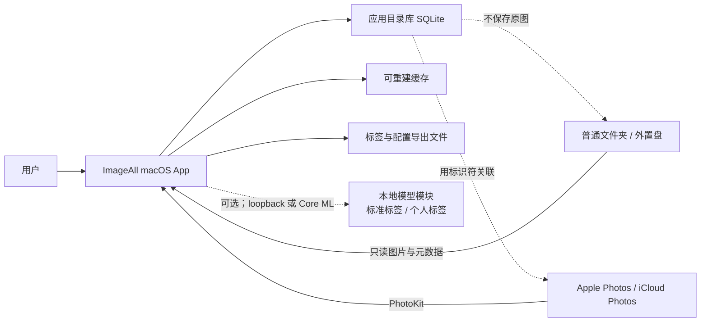
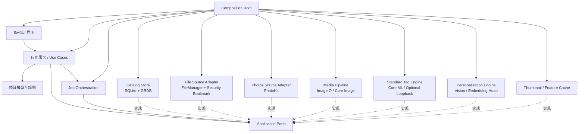
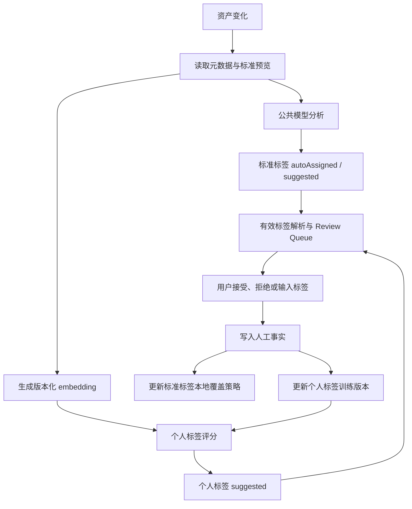

# ImageAll 架构设计

> 状态：Draft v0.6<br>
> 日期：2026-07-19<br>
> 目标读者：产品开发者、后续参与实现与评审的工程师<br>
> 决策范围：首个可用版本（MVP）及其可演进边界

## 1. 摘要

ImageAll 是一款本地优先的原生 macOS 图片管理与个性化多标签应用。它统一索引两类资产：

1. 用户选择的普通文件夹，包括外置磁盘上的多 TB 图片档案；
2. 当前 Mac 的 Apple Photos 照片库。

应用不搬运、不修改原图。它在自己的 SQLite 目录库中保存资产索引、标签定义、人工确认/拒绝记录、视觉特征版本和模型预测。标签能力分为两条并行轨道：公开世界知识对应版本化的标准标签及公共模型，可以在用户尚未积累标注时提供带来源的自动标签；个人关系、用途和偏好对应用户自定义标签，只能随用户正负反馈逐步学习。人工决定永远优先，任何模型结果都不得伪装或覆盖人工事实。

MVP 的核心闭环是：

```text
添加图片来源 → 建立可恢复索引
├─→ 公共模型 → 标准标签自动结果 → 用户确认或纠错
└─→ 用户创建个人标签 → 积累正负样本 → 个性标签建议
                                      ↓
                           用户确认/拒绝 → 更新个人模型
```

现有 MVP 已关闭个人标签的人工标注与少样本建议闭环；阶段 5 在此基础上增加标准标签轨道。
公共模型的准确率、标准标签覆盖率和本地部署成本必须按 provider 与版本独立评测，不能把某个
模型的输出当作无版本的世界事实。现有 Vision Feature Print 继续作为个性化轻量基线。

首版不做云端服务、不写回 Apple Photos 关键词、不训练端到端神经网络，也不提供删除或移动原图的能力。

## 2. 背景与问题定义

现有照片管理工具通常只能提供“固定通用 AI 标签”或彼此孤立的用户手工标签。ImageAll 同时解决两类问题：用公开模型为客观、可复用的视觉概念提供开箱即用的标准标签；让用户用少量正负样本定义任意个人标签，并持续改进预测。两条轨道都是多标签问题，不能退化为互斥多分类，也不能共用一套没有来源和版本的标签词表。

一张图片可以同时具有多个标签，例如：

- `家人`
- `需要修图`
- `适合打印`
- `工作参考`
- `票据`

例如“海滩”“狗”“室内”可以绑定公开 ontology 概念；“家人”“需要修图”“适合打印”依赖个人关系、用途或偏好。公共模型结果可以作为明确标注来源的自动标签参与浏览和筛选，但仍是可重建派生数据；个人模型结果只作为待确认建议。用户接受、拒绝和纠错始终是一等事实。

用户拥有数 TB 图片，因此架构必须满足以下前提：

- 文件夹是大规模原始档案的主要来源；
- Apple Photos 是另一个受支持的数据源，而不是文件路径；
- 初次索引可耗时，但必须可暂停、可恢复；
- 后续只处理新增或变化的资产；
- 内存使用不能随全部资产数量线性增长；
- 原图不可复制进应用目录作为长期存储。

## 3. 目标与非目标

### 3.1 MVP 目标

- 原生 macOS 浏览与标签界面；
- 添加、停用和重新授权文件夹来源；
- 读取 Apple Photos 图片资产；
- 统一浏览、筛选和搜索两个来源的图片；
- 创建、重命名、归档自定义标签；
- 可选安装一组常用标签预设，作为个人标签起点；
- 单张或批量添加人工标签；
- 明确记录正例、反例和未判断状态；
- 从少量正负样本产生本地标签建议；
- 显示建议强度或排序，并支持接受或拒绝；
- 后台增量索引、失败重试和进度展示；
- 导出不可重建的用户数据。

### 3.2 明确非目标

- 不托管或同步原图；
- 不依赖账号、服务器或互联网才能使用；
- 不修改、移动或删除来源中的原图；
- 不直接读取 `.photoslibrary` 包内部文件；
- 不向 Apple Photos 写入任意关键词；
- 不在 MVP 中实现 iPhone/iPad 客户端；
- 不在 MVP 中实现人脸身份识别、OCR、GPS 语义或相册关系推理；
- 不在 MVP 中自动合并或删除重复图片；
- 不把 NAS、SMB/NFS 目录或其他网络文件系统作为受支持的 MVP 来源；
- 不在 MVP 中自动导入或恢复可移植导出；导出格式先保证可检查和可演进；
- 不在 MVP 中训练或微调整个视觉神经网络；
- 不把预测标签自动当成人工确认标签。

### 3.3 阶段 5 演进目标

- 安装版本化标准标签包，保留公开概念 ID、DAG 层级、模型来源和本地显示名；
- 标准概念与用户个人标签使用独立命名空间和模型生命周期；
- 标准公共模型在零用户样本时提供带来源的自动标签，个人模型只从人工正负决定学习；
- 两条轨道共用人工覆盖规则、Review Queue、任务恢复和原图只读边界。

## 4. 架构原则

1. **原图只读**：任何索引、分析或导出失败都不能损坏用户资产。
2. **用户决定优先**：人工接受和人工拒绝均是持久事实，模型不得覆盖。
3. **来源无关**：领域层不依赖文件路径或 `PHAsset`；来源差异留在适配层。
4. **派生数据可重建**：缩略图、视觉特征和预测都可以删除后重新生成。
5. **增量优先**：昂贵的解码、特征和预测只处理新增或变化资产；来源发现可以采用流式全量对账。
6. **任务可恢复**：耗时工作以小批次提交进度，应用退出后可以续跑。
7. **版本显式**：视觉特征、分类器、阈值和预测都携带版本。
8. **首版简单**：一个 App target、一个单元测试 target；先用目录分层，不提前拆多个 Swift Package。
9. **标签双轨**：标准概念、个人标签、人工事实和机器结果分别记录；同名不等于同语义，同一模型分数不跨轨道比较。

## 5. 系统上下文



应用维护的是“目录库”，不是新的照片库：

- 文件资产通过来源根目录与相对路径定位，并用资源标识符和内容指纹判定身份；
- Photos 资产通过 `PHAsset.localIdentifier` 定位；
- 两种资产都映射成统一的 `Asset`；
- 原图留在原来源，应用只保存元数据和派生数据。

## 6. 总体架构



箭头表示编译期依赖。应用服务和任务编排只依赖 Application Ports；基础设施实现反向依赖这些 Ports。Composition Root 是唯一同时认识抽象与具体实现的地方，负责构造并注入对象。

### 6.1 表现层

采用 SwiftUI，必要时用 AppKit 包装 macOS 特有能力，例如目录选择、菜单、快捷键和高级拖放。界面只调用应用服务，不直接操作 PhotoKit、文件系统或数据库。

主要页面：

- 来源管理；
- 图片网格与详情；
- 标签管理；
- 待确认建议；
- 后台任务与错误；
- 数据导出和修复。

### 6.2 应用服务层

每个用户动作对应一个明确用例：

- `AddFolderSource`
- `ConnectPhotosLibrary`
- `ScanSource`
- `CreateTag`
- `InstallStandardTagPack`
- `ApplyManualTag`
- `RejectTag`
- `GenerateStandardAssignments`
- `GenerateSuggestions`
- `AcceptSuggestion`
- `ExportUserData`

应用服务负责事务边界和任务编排，不包含图像算法细节。

### 6.3 领域层

领域层保存不依赖框架的核心规则：

- 一个资产可拥有多个标签；
- 标签定义必须区分版本化标准概念与用户个人语义；
- 同一资产和标签只能有一个最终人工判断；
- `accepted` 与 `rejected` 互斥；
- 公共模型自动结果和个人模型建议都不能覆盖人工判断；
- 公共模型不得自动创建个人标签，开放词表输出只能成为待用户批准的标准概念候选；
- 标签归档后停止产生新建议，但保留历史关系；
- 资产暂时不可访问时标记为 `unavailable`，不删除其标签；
- 资产内容发生变化时，仅使派生数据失效，人工标签仍保留并提示复核。

### 6.4 基础设施层

- PhotoKit：获取 Photos 元数据、缩略图和变化历史；
- FileManager / URL：枚举用户授权目录；
- security-scoped bookmark：跨启动恢复目录只读权限；
- ImageIO / Core Image：解码、方向校正和缩放；
- Vision：生成首版视觉 Feature Print；
- SQLite + GRDB：目录库、事务、迁移、索引和查询；
- Swift Concurrency：受控并发、取消和后台流水线。

## 7. 代码组织

MVP 保持单工程、单 App target，按职责使用目录边界：

```text
ImageAll/
├── App/
│   └── CompositionRoot/
├── Application/
│   ├── UseCases/
│   ├── Ports/
│   └── Jobs/
├── Features/
│   ├── Library/
│   ├── Tags/
│   ├── Suggestions/
│   ├── Sources/
│   └── Settings/
├── Domain/
│   ├── Models/
│   └── Rules/
├── Infrastructure/
│   ├── Database/
│   ├── FileSource/
│   ├── PhotosSource/
│   ├── Media/
│   ├── Personalization/
│   └── JobQueue/
└── Resources/

ImageAllTests/
├── Domain/
├── Database/
├── Sources/
└── Personalization/
```

只有在出现独立发布、显著编译时间或复用需求时，才把目录拆成 Swift Package。

## 8. 统一资产模型

### 8.1 资产标识

应用使用内部不可变 UUID `asset_id`。来源定位信息单独保存：

```swift
enum AssetLocator: Codable, Sendable {
    case file(relativePath: String)
    case photos(localIdentifier: String)
}
```

不把绝对路径当作长期身份。文件来源的根目录由 security-scoped bookmark 定位，单个资产只保存相对路径。路径是定位信息，不等于资产身份。MVP 使用以下保守规则：

1. 同一路径且资源标识符未变：视为同一资产；大小或修改时间变化时增加 content revision，保留人工标签并提示复核；
2. 同一路径但资源标识符已变，或原文件曾缺失后出现另一文件：创建新 `asset_id`，旧资产保持不可用，新资产不继承旧标签；
3. 文件在同一来源内移动：只有稳定资源标识符匹配，或唯一 SHA-256 匹配时，才把新路径重新绑定到原 `asset_id`；
4. 多个候选命中、指纹不足或文件系统不提供稳定资源标识符时，不自动合并，等待用户确认；
5. SHA-256 只按需计算，用于歧义消解和去重，不作为首次扫描的必需成本。

该规则优先避免把旧标签错误赋给新图片，即使代价是少数移动文件需要人工重新关联。

一个 Asset 明确表示“一个 Source 中的一次可定位出现”，不是跨来源去重后的逻辑图片。同一字节如果出现在两个 Source 中，就产生两个 `asset_id`；MVP 拒绝添加互相包含的文件夹根目录，避免因重叠 Source 重复索引。同一 Source 内的硬链接按不同相对路径视为不同 Asset；resource identifier 只有在“旧路径消失且新路径唯一命中”时才能用于移动重连。自动去重与跨来源合并不属于 MVP。

Photos 的 `localIdentifier` 只在当前本地照片库上下文中使用。跨设备标签同步不属于 MVP；若以后增加该能力，再引入 `PHCloudIdentifier`。

### 8.2 标签语义与赋值状态分离

标签定义先区分语义轨道：

| 轨道 | 定义所有者 | 示例 | 无用户样本时能否工作 |
|---|---|---|---:|
| `standard` | 版本化公开 ontology；用户只能设置本地别名、启用状态和覆盖决定 | 海滩、山地、狗、室内、黑白 | 是 |
| `personal` | 当前目录库用户 | 家人、项目 A、需要修图、适合打印 | 否 |

同一个资产与标签之间再区分赋值来源和状态：

| 类型 | 含义 | 是否可被模型覆盖 |
|---|---|---:|
| `manualAccepted` | 用户确认属于该标签 | 否 |
| `manualRejected` | 用户确认不属于该标签 | 否 |
| `autoAssigned` | 版本化公共模型达到该标准概念的批准门槛 | 是，可重新计算 |
| `suggested` | 公共模型低于自动门槛，或个人模型给出的待审核建议 | 是，可重新计算 |

目录库的不可重建真相仍只有人工决定。界面允许把 `autoAssigned` 作为“AI 自动标签”参与展示与
筛选，但必须暴露来源，不能显示成人工确认。有效结果解析顺序固定为：`manualRejected` 压制所有
机器结果，`manualAccepted` 覆盖机器状态；没有人工决定时，标准轨道才可显示 `autoAssigned`，其余
结果进入 Review Queue。用户确认机器结果后写入人工决定，而不是把原 prediction 改造成事实。

“未标注”不是负例。只有显式拒绝或用户指定的负样本才进入个人模型的负例集合。公共模型可以在
零用户样本时运行，但前提是已经安装并启用可审计的标准模型包；“零用户样本”不等于没有标准
概念定义、模型权重或校准策略。

## 9. 数据持久化设计

### 9.1 存储选择

选择 SQLite + GRDB，而不是把目录库建立在 SwiftData 上。原因是该应用需要显式 schema、批量 upsert、复合索引、可控迁移、后台写入和百万级元数据查询。GRDB 保留标准 SQLite 文件的可检查性，同时提供 Swift 接口、迁移、观察和并发支持。

首个目录库的六张业务表使用 SQLite `STRICT` table，使 TEXT / INTEGER / BLOB 数据字典成为真实写入约束，并让完整性检查覆盖列类型；GRDB 自有 migration 表除外。以后每个新增业务表仍默认采用 STRICT，若需要 SQLite 动态类型必须单独记录理由。

数据库位于应用的 Application Support 容器。缩略图和视觉特征放入独立 Cache 目录，避免数据库备份被可重建二进制数据放大。

### 9.2 逻辑表

| 表 | 关键字段 | 职责 |
|---|---|---|
| `source` | `id`, `kind`, `display_name`, `bookmark`, `sync_cursor`, `scan_generation`, `dirty_epoch`, `state` | 文件夹或 Photos 来源 |
| `asset` | `id`, `source_id`, `locator`, `locator_state`, `media_type`, `width`, `height`, `created_at`, `modified_at`, `content_revision`, `last_seen_generation`, `availability` | 统一资产元数据；当前定位与来源可用性分离 |
| `file_fingerprint` | `asset_id`, `size`, `mtime`, `resource_id`, `sha256` | 文件变化和移动检测 |
| `tag` | `id`, `name`, `normalized_name`, `state`, `created_at` | 本地标签行；v009 保持 v001 DDL 不变，无 `standard_tag_binding` 的行按个人标签处理 |
| `catalog_scope` | `singleton`, `scope_id` | v007 为当前目录库生成并持久化一个不透明 UUID；personal bundle 握手只允许精确匹配该 scope |
| `ontology_pack` | `standard_pack_id`, `standard_pack_revision`, `ontology_id`, `ontology_revision`, `locale_revision`, `manifest_sha256`, `state`, `installed_at_ms` | v009 已安装标准标签包与完整性身份 |
| `ontology_concept` | `ontology_id`, `ontology_revision`, `concept_id`, `canonical_name`, `normalized_name` | v009 版本化标准概念 |
| `ontology_edge` | `ontology_id`, `ontology_revision`, `parent_concept_id`, `child_concept_id` | v009 标准概念 DAG；同一概念可有多个父节点 |
| `standard_tag_binding` | `tag_id`, `ontology_id`, `ontology_revision`, `concept_id` | v009 把标准概念绑定到稳定本地 Tag ID；缺少绑定即为个人标签 |
| `asset_tag_decision` | `asset_id`, `tag_id`, `decision`, `updated_at` | 用户接受或拒绝的事实 |
| `feature` | `asset_id`, `provider`, `revision`, `content_revision`, `cache_key` | 视觉特征索引 |
| `standard_model_revision` | `standard_pack_id`, `standard_pack_revision`, `provider`, `model_revision`, `preprocessing_revision`, `mapping_revision`, `policy_revision`, `weights_sha256` | v009 一组标准概念共用的公共模型身份 |
| `standard_prediction` | `asset_id`, `tag_id`, `content_revision`, `standard_pack_id`, `standard_pack_revision`, `score`, `recommended_state`, `state`, `created_at_ms`, `derived_from_concept_id` | v010 可重建标准结果；v011 保留 direct/derived 来源，当前 `state` 固定为 `pendingReview` |
| `tag_model` | `tag_id`, `current_revision` | 个人标签当前模型指针 |
| `tag_model_revision` | `tag_id`, `revision`, `provider`, `threshold`, `sample_budget`, `created_at` | 不可变的个人标签模型版本；metrics 与 selection policy 尚未进入 v004 |
| `tag_model_sample` | `tag_id`, `model_revision`, `asset_id`, `content_revision`, `role`, `rank` | 可复现的正负代表样本集合 |
| `evaluation_assignment`（规划） | `asset_id`, `tag_id`, `cohort_id`, `split`, `content_hash` | 稳定的训练/验证/测试归属；当前 v004 尚未建立 |
| `prediction` | `asset_id`, `tag_id`, `track`, `content_revision`, `model_revision`, `policy_revision`, `score`, `state`, `created_at` | 标准自动结果或可丢弃建议；状态为 `autoAssigned` 或 `suggested` |
| `job` | `id`, `kind`, `payload_version`, `payload`, `source_id`, `checkpoint_version`, `checkpoint`, `scan_generation`, `started_dirty_epoch`, `state`, `control_request`, `priority`, `attempts`, `lease`, `last_error` | 可恢复后台任务 |

本表同时标明目标逻辑模型与当前实现。v009 已交付 ontology package、concept、edge、standard model
identity 和 `standard_tag_binding`；它不改写 v001 `tag` DDL，而以绑定存在性投影 standard/personal
命名空间。v010 已交付 direct concept 的 `standard_prediction` 与 Review Queue 投影；即使 provider
返回 `autoAssigned` recommendation，当前仍固定进入 `pendingReview`，不会绕过人工确认成为事实。
v011 沿精确 ontology revision 展开祖先并记录 direct concept 来源；既有 v010 行的来源为空，保持 direct。
现有普通标签全部保守保持个人语义，不按名称自动绑定 concept。

关键约束：

- v001 的 `tag_normalized_name_uq` 继续保护个人标签并发唯一性；标准标签在该列使用稳定内部 identity key，用户可见规范名来自 `ontology_concept.normalized_name`，所以同名 personal/standard 可并存；
- 标准本地身份以 `ontology_id + concept_id` 唯一，绑定同时记录精确 ontology revision；当前 installer 对 revision/identity 冲突 fail closed，不迁移旧人工事实；
- `ontology_edge` 必须引用同一 ontology revision，安装时拒绝环；DAG 允许一个子概念拥有多个父概念；
- `asset_tag_decision(asset_id, tag_id)` 唯一；
- `standard_prediction(asset_id, tag_id, content_revision)` 唯一；
- `feature(asset_id, provider, revision, content_revision)` 唯一；
- `tag_model_revision(tag_id, revision)` 唯一，`tag_model_sample(tag_id, model_revision, asset_id)` 唯一；`tag_model(tag_id, current_revision)` 必须引用已存在的 revision；
- `tag_model` 与 `tag_model_sample` 只服务 `personal` 标签；标准模型版本不能混入用户个人样本；
- 每个 Source 内同一 locator 只能有一个 `locator_state = current` 的 Asset；Source 离线或 Asset 缺失不释放当前 locator，只有确认路径复用或移动重连时才在事务内变更绑定；
- 删除标签默认采用归档，不级联删除人工历史；
- 移除来源默认只停用 Source，保留 Asset、人工决定和派生数据；永久清除必须再次确认，并先提供可移植导出。永久清除后才允许删除该 Source 的 Asset、人工决定和缓存。

### 9.3 真相与缓存

不可重建、必须纳入应用内部操作快照：

- 来源定义和授权书签；
- 自定义标签；
- 人工接受与拒绝；
- 用户配置的阈值；
- 必要的模型训练元数据；
- 用户对标准标签的本地别名、启用状态和人工覆盖决定。

内部操作快照用于数据库迁移失败或同一 Mac 上的恢复，可以包含 security-scoped bookmark。它不同于可移植用户导出。

内部快照使用 SQLite online backup API 从一致性读视图生成：先写入 `Backups/<snapshot-id>.tmp/` 中的数据库文件，执行 `PRAGMA quick_check` 并生成带 schema version 与校验和的 manifest，再把整个临时目录原子重命名为 `Backups/<snapshot-id>/`。每次 schema migration 前必须生成一份；事实数据发生变化时每天至多生成一份，并至少保留最近三份成功快照。恢复时关闭当前数据库、保留故障副本、校验快照后再替换，绝不在失败后静默创建空库。快照与主库在同一设备上，只防操作或迁移故障，不构成磁盘灾难备份；用户仍需把可移植导出纳入外部备份。

可移植用户导出必须带 schema version，并包含来源的稳定内部 ID、种类和显示名，文件相对路径与已有
指纹、标签、人工决定、用户阈值和必要训练元数据。双轨 schema 生效后，标签记录还必须包含 `kind`；
标准标签包含 ontology/concept/revision 绑定和本地别名，导出只记录标准包 identity，不复制可重新安装的
公共模型权重。它不导出 security-scoped bookmark。MVP 只生成并校验导出，不实现自动导入；未来恢复
工具必须要求用户重新授权来源。Photos 的 local identifier 只能用于同一照片库的最佳努力重连，不能承诺
跨设备恢复。导出父目录必须与全部已记录文件夹来源隔离：与来源相同、位于来源内、包含来源或关系
无法确认时都在创建临时目录前拒绝。production target 为本次用户选择的导出位置保留 app-wide
`user-selected.read-write`，但文件夹来源 bookmark 始终显式使用只读选项，导出 scope 不持久化；全局
entitlement 不能被解释为允许写入来源树。

可重建、允许清空：

- 缩略图；
- 视觉特征；
- 标准模型自动结果与个人模型建议；
- 扫描统计和临时任务日志。

所有数据库外派生文件都遵循 `临时文件 → 完整写入 → 校验 → 原子重命名 → 数据库提交引用`。崩溃可能留下未被数据库引用的孤儿文件，但不能留下指向半文件的事实记录；启动后的低优先级清理任务回收孤儿文件。

## 10. 资产来源适配

### 10.1 文件夹来源

用户通过系统目录选择器授权一个根目录。应用创建只读的 app-scoped security-scoped bookmark，并在每次访问期间成对调用 `startAccessingSecurityScopedResource()` 与 `stopAccessingSecurityScopedResource()`。

扫描规则：

- 递归枚举，不一次性把全部 URL 读入内存；
- 只处理普通文件；默认不跟随符号链接或 Finder alias，不进入任何 package descendants，并无条件跳过 `.photoslibrary`；
- 只读取支持的图片 UTI；
- 忽略应用缓存、隐藏系统目录和明确配置的排除项；
- 以小批次写入数据库；
- 首次只采集低成本元数据，不立即计算所有 SHA-256；
- 目录离线或外置盘拔出时暂停任务，并保留持久化目录工作队列；
- 每次对账创建新的 `scan_generation`，流式枚举目录并标记本轮已见资产；
- 只有完整 generation 成功结束后，才把本轮未见资产标记为不可用；中断扫描不得据此判定删除；
- 每个批次的 Asset upsert、`last_seen_generation` 和 Job checkpoint 在同一 SQLite 事务提交；崩溃后允许从头重跑同一 generation，依靠唯一约束实现 at-least-once 幂等；
- 通过快速指纹比较后，只有新增或变化资产进入缩略图、特征和预测流水线；
- FSEvents 在 MVP 只用于合并并触发新的对账，不直接翻译成资产事实；应用启动、用户手动刷新和事件日志重置也会触发对账。每次文件事件在数据库事务中递增 Source 的 `dirty_epoch`。Job 启动时捕获 `started_dirty_epoch`；完成 generation 时只有两者仍相等才可标记 clean，否则必须先持久化下一次对账 Job，不能用当前扫描完成状态覆盖扫描期间到达的新事件。

因此，MVP 的“增量”指避免对未变化资产重复执行昂贵处理，而不是完全跳过目录命名空间枚举。扫描期间发生的并发变化允许在下一次对账收敛。

文件在解码或生成特征前后各读取一次大小、修改时间和 resource identifier；若两次结果不一致，本次派生结果丢弃并重新排队。resource identifier 变化必须先执行第 8.1 节的身份判定：默认创建新 Asset，不能仅给旧 Asset 增加 Revision。只有身份仍确认是同一 Asset 时，大小、修改时间或已存在的内容指纹变化才递增 `content_revision`。普通对账无法发现“内容被替换但大小、mtime 和 resource identifier 全部被刻意保持”的情况；MVP 将此记录为已知限制，并提供显式“深度验证来源”任务按需计算 SHA-256。

MVP 支持的格式以 ImageIO 能稳定解码的静态图片为准，具体清单在实现阶段通过运行时能力测试冻结。RAW 和视频不进入首个分类闭环。文件夹来源不识别 Live Photo 组合；PhotoKit 来源把 Live Photo 的静态主图作为普通支持图片读取，不读取其视频伴随资源。

### 10.2 Apple Photos 来源

Photos 适配器只使用 PhotoKit，不遍历 `.photoslibrary` 包。它负责：

- 请求照片库读取授权；
- 枚举图片 `PHAsset` 元数据；
- 通过 `PHCachingImageManager` 获取本地限定列表缩略图，并把规范化结果写入应用派生缓存；
- 请求适合视觉分析的缩放图，而不是默认下载原图；
- 保存并消费 persistent change token；
- token 失效或变化记录不完整时执行可恢复的全量校验。

首次同步在枚举前保存起始 `PHPersistentChangeToken`，完成全量枚举后重放该 token 之后的变化，再发布“同步完成”状态。变化批次、对应 Asset 事实和新 token 在同一 SQLite 事务提交；若崩溃，旧 token 会导致安全重放，唯一约束保证幂等。全量校验同样使用 generation，只有完整枚举并完成增量重放后，才允许把未见 Photos Asset 标为源端删除。

PhotoKit 报告资产更新，或其 `modificationDate`、像素尺寸、媒体子类型等参与指纹的字段变化时，递增 `content_revision` 并使派生数据失效。照片库暂时不可用或权限撤销时保留既有 Asset 事实与标签，不能被解释为批量删除。当前 MVP 不保存独立的照片库身份，因而不能自动区分 System Photo Library 切换与大规模合法变化。图库 unavailable 时当前 Source 先 fail-closed；用户显式确认重绑定后，为当前系统图库新建 active Source，旧 unavailable Source/Asset 作为历史事实保留。系统最多存在一个 active Photos Source，但可存在多个历史 Photos Source；新旧 local identifier 始终按 Source 隔离，不自动合并、迁移或删除。

MVP 已冻结为 macOS 15+ 并采用 persistent change history；change token 无效或无法证明连续历史时，回退为可恢复的完整 generation。PhotoKit change observer 与启动追赶只负责合并并触发 reconcile，不直接写 Asset 事实。

部分资产可能只有 iCloud 副本。默认只索引元数据，网格预取、详情、Feature Print 和后台建议请求均保持本地限定，不自动触发下载。Photos 网格先复用显式下载预览，再按 Asset ID、`content_revision`、representation version 和 `gridRegular` variant 查询统一派生缓存；未命中才请求 local-only PhotoKit，并把规范化缩略图原子发布到应用缓存。缓存损坏或事实版本变化沿用统一失效规则，任何缓存写入失败只退化为本次内存结果。Photos Adapter 是唯一可以构造 `PHImageRequestOptions` 的模块。MVP 采用用户已批准的“单图标准预览”：只有用户在 Inspector 对当前资产点击“获取预览”后，应用服务才签发该次请求的不透明能力，Adapter 才为一个 `2_048 × 2_048` target、`aspectFit` 请求设置 `isNetworkAccessAllowed = true`；缓存标准预览长边最多 2048px，不放大、不裁剪。调用方不能通过裸 `Bool` 绕过该策略。

单图请求的界面状态区分可获取、下载中、失败和已下载，并支持进度、取消与重试。成功结果进入 512 MiB LRU 下载预览子配额，随后供 Inspector、网格、Feature Print、全库建议和 Review Queue 复用，缓存命中不再读取 PhotoKit。该子配额不是额外磁盘预算：条目仍计入统一派生缓存配额，并受磁盘安全余量约束。批量云下载、后台自动获取和通用 job-scoped grant 不属于 MVP；未来若引入，必须另行设计任务级授权、计量、取消与配额契约。

原生 macOS 当前 SDK 将 `PHAuthorizationStatusLimited` 标为 iOS-only，因此 MVP 不假设持续 Photos Source 存在“受限照片库”授权。`PhotosPicker` 的 `Transferable` 选择结果也不作为可持续增量索引的 Locator。若未来要支持只选少量 Photos 资产并跨启动保留，必须先单独验证标识和数据保留契约。

### 10.3 统一来源协议

```swift
protocol AssetSource: Sendable {
    func reconcile(from checkpoint: SourceCheckpoint?) -> AsyncThrowingStream<AssetChange, Error>
    func metadata(for locator: AssetLocator) async throws -> AssetMetadata
    func preview(for locator: AssetLocator, request: PreviewRequest) async throws -> CGImage
}
```

`PreviewRequest` 默认只允许本地内容；显式单图下载使用独立应用服务契约并附加单次不透明能力。应用与领域核心只认识 `AssetChange`、`AssetMetadata`、`AssetLocator` 和授权能力，不认识 `URL`、`PHAsset` 或 `PHImageRequestOptions`。

## 11. 图片处理与双轨标签学习

### 11.1 处理流水线



每个阶段独立幂等。任一阶段失败只记录当前资产和阶段，不回滚已完成的其他资产。

### 11.2 已交付的个人标签基线

首版采用 Vision `VNGenerateImageFeaturePrintRequest` 提取视觉特征，并用每个标签的少量正负样本执行距离型分类。选择它是为了先验证产品闭环，不引入模型下载、Python 环境或训练服务。

当前已交付行为和兼容边界固定为：

- v006 的标签预设只创建普通 `Tag`，不得自动写入 `asset_tag_decision`、生成预测或启动分析；
  双轨 schema 迁移时，这些历史标签默认迁移为 `personal`，不得仅凭名称猜测并绑定公开概念；
- 新的标准标签包使用独立 `standard` 命名空间。同名个人标签与标准概念不得静默合并；用户可以
  分别保留、设置本地别名，未来若提供显式绑定工具也必须保留原人工历史和可撤销记录；
- Vision Feature Print 与距离评分，以及可选的线性分类器或近似最近邻都属于可替换基线，
  当前阶段优先保证吞吐、内存上界、可恢复任务和结果可审核；
- 当前阶段不要求对现有照片形成完整标签体系，也不以统一准确率、召回率、Top-K 命中率或
  样本覆盖率阻塞交付；运行校准只用于发现明显缺陷和记录算法局限；
- 个人模型输出只能写入可重建 `suggested` prediction，并经 Review Queue 由用户确认或拒绝，
  不能直接变成人工标签事实。

每标签评分的最小实现：

1. 收集该标签的人工正例和显式反例；
2. 计算待分类资产到正例、反例的 Feature Print 距离；
3. 分别取最近若干样本的稳健平均距离；
4. 根据正负距离差得到排序分数；
5. 只有达到最低样本量和阈值时才显示建议；
6. 用户的接受/拒绝生成新训练版本，并使旧建议失效。

MVP 不把分数宣传为统计意义上的概率。当前界面只使用标签内排序，不显示固定“高/中/低”、
百分比或“置信概率”；只有未来针对具体 provider 和版本完成独立校准后，才能新增相应强度文案。

为控制计算量，MVP 为每个标签设置固定的正负代表样本预算，具体上限和选择策略由阶段 3 原型冻结并写入 `tag_model_revision`。实际选中的 Asset、对应 `content_revision`、正负角色和稳定顺序写入 `tag_model_sample`，保证同一 revision 可复现。新增资产只对当前启用标签评分；用户反馈只使受影响标签的当前建议失效，并以分页后台任务逐步重算。查询不回退展示旧 revision 的结果。线性分类器或近似最近邻可作为后续传统算法优化，但当前阶段不因标签准确率或样本覆盖不足而强制切换。

建议任务必须带显式 `SuggestionScope`（来源、日期范围、筛选结果或用户选择集），按分页候选运行；MVP 不在后台对“全库 × 全部标签”做无界预计算。阶段 3 开始前必须用目标 Mac 冻结可支持的候选资产数、启用标签数和每标签代表样本数。请求超出已验证 envelope 时，UI 要求缩小范围，或者先完成线性分类器/近似最近邻 spike，不能降级为不可预期的长任务。

未来 evaluation slice 按 `asset_id + tag_id + evaluation_seed` 产生并持久化稳定 split；字节相同的
已知重复样本使用内容哈希强制进入同一 split。届时测试 split 不参与代表样本选择，也不进入建议审核
队列；每个 `cohort_id` 冻结后不再吸收后续反馈，模型间比较只使用共同 cohort，新反馈进入下一 cohort，
避免反馈闭环逐轮污染历史测试集。该契约尚未进入当前 v004，不是现有运行行为。

### 11.3 双轨标签契约

#### 11.3.1 标准标签轨道

标准标签面向公开、可复用且主要能从画面判断的概念，例如场景、常见对象和视觉属性。它不是
“永远正确”的社会事实，而是一个可审计的 ontology/model package：

- 每个标准概念具有稳定 `ontology_id + concept_id`、明确 ontology revision 和本地化显示名；
- 层级使用有向无环图而不是单棵树；例如“海滩”可以同时属于“自然风景”“水域”和“旅行场景”；
- provider 原始类别必须经版本化 mapping 映射到标准概念，不能把模型自由文本直接当 concept ID；
- provider 只返回直接命中的 concept，App 按当前 ontology revision 展开祖先闭包；父标签是带
  `derivedFromConcept` 来源的机器派生结果，不写入人工决定；
- 每个 provider/model/preprocessing/policy revision 分别固定自动展示门槛和 Review Queue 门槛；
- 达到自动门槛的结果写为 `autoAssigned`，达到审核门槛但未达到自动门槛的结果写为
  `suggested`，其余不落库；分数只在同一 provider 和 policy revision 内排序；
- 标准模型可以在零用户样本时运行。用户纠错先形成当前目录库的人工覆盖和校准数据，不得静默
  回写、微调或重新发布公共基础模型。

安装标准包本身不立即无界扫描图库。用户启用包时必须选择或确认 `SuggestionScope`，任务按资产分页，
同一资产对同一标准模型 revision 至多执行一次推理，再把一次输出映射到多个概念。后续只处理新增或
变化资产。该任务复用已有本地标准预览，不能因此批量下载 iCloud 图片。

人物身份、私人关系、价值判断、用途和项目归属不进入标准自动标签包。开放词表模型或 VLM 发现的
新词只能进入“标准概念候选”流程；只有经过词义、父节点、许可证和评测审核并发布新的 ontology
revision 后，才能成为标准概念。

#### 11.3.2 个人标签轨道

个人标签由用户在 App 中选择已有标签、输入新标签，或确认 Review Queue 建议而形成。其训练规则为：

- 标签定义和正负样本都属于当前目录库；用户输入新标签并应用到当前选择时，原子创建标签和
  `manualAccepted`；
- 只有 `manualAccepted` 和 `manualRejected` 进入训练 manifest，未标注资产不得当作负例；
- 未达到当前 `2 + 2` 硬门时不生成个人模型建议；达到门槛后使用冻结 embedding 加每标签轻量
  分类器，并随用户反馈生成新的不可变 bundle revision；
- 个人模型只能返回已存在的个人 `tag_id`，不得根据自由文本自动扩充用户词表；
- 模型 bundle 绑定目录库作用域、标签稳定顺序、encoder/preprocessing revision 和人工决策快照
  revision，不得与其他目录库或用户混用。

当前可选 DINO 路径已实现用户触发的最小重建闭环：App 只选择 current catalog 中 active 且满足
`2 accepted + 2 rejected` 的标签，每标签每角色最多取 12 条最新人工决定；对去重后的
`asset_id + content_revision` 逐项请求 loopback DINO embedding，并在发送前再次确认人工快照未变化。
每个请求携带 schema revision、当前 catalog scope、canonical asset UUID 和十进制 content revision
作为可选缓存键；后端再绑定实际 provider 的完整 encoder identity。无键调用与未配置缓存的服务保持
既有行为，任何 identity/revision 不匹配或缓存损坏都只按 miss 重新计算。
同步 rebuild payload 只含 canonical UUID/revision、embedding 和明确人工决定，不含原图、locator、路径
或 bookmark。后端以当前 `bundle_revision + weights_sha256` 做 CAS，候选训练与完整重载校验成功后才
原子切换 active bundle；App 再读取 capability，完整身份相等才报告成功。模块离线、样本不足、图片
本地不可用、身份冲突或发布失败均不改变旧 bundle，也不回退 standard。
若旧 active bundle 仍含刚归档的标签，personal 推理继续 fail closed；显式 rebuild 仍可使用该旧
revision/weights 作为 CAS 基线，并把新 bundle 词表收敛到当前 active 标签，避免归档动作永久阻断更新。

当前 personal 全库建议已接入统一持久任务与审核闭环：用户只能从 Review Overview 显式启动，App
先读取并校验当前 catalog、active 标签词表与完整 bundle/encoder/policy identity，再在一个 GRDB 写
事务中原子激活该 capability 并写入冻结 active source、catalog cutoff 与完整身份的持久 job。若已有
非终态 personal job，只有 payload capability 与数据库 active identity 都完全相同时才幂等复用；
其他冲突不替换 active identity，也不改旧 job。

异步 handler 按稳定 Asset ID 继续 checkpoint，每个资产在 lease-protected 事务中一起提交 prediction、
进度和 cursor。读取本地预览前后及推理后都核对 capability；bundle、权重、encoder、词表或 policy
任一变化都清除该 capability 的可重建 personal 结果并 fail closed。iCloud-only 或其他本地预览不可用
资产只计为跳过，不签发批量下载能力。一次响应可为同一资产产生多个既有 `tag_id`，但人工决定始终
优先，机器结果固定为待审核建议。

App 通过 v008 的 `personal_suggestion_model`、`personal_suggestion_tag` 和 `personal_prediction` 保存
当前已确认的完整 capability 与可重建建议；bundle 切换以级联删除清理旧结果。personal 与 Feature
Print 对同一 `asset_id + tag_id` 重叠时，Review Queue 只显示一次并明确标记“个人 DINO”来源，不
横向比较两种 provider 的原始 score。任务复用第 12 节既有队列，支持启动恢复、checkpoint、暂停、
继续、取消、retryable `not_before` 到期唤醒，以及服务恢复后的显式立即重试；失败或 App 重启不回滚
已提交建议，且不另建第二套后台
状态机。该能力仍只由用户显式触发，不构成自动后台重训。

标准标签也允许用户接受或拒绝；这类人工决定服从统一优先级，但不会把标准概念改成个人标签。
用户如果需要更细的个人语义，例如在标准“狗”下建立“我的宠物”，应创建独立个人标签并单独训练。
人工决定只作用于用户操作的精确标签，不沿 DAG 自动接受或拒绝其他节点；遇到“接受子概念但拒绝
父概念”时保留两项事实，由界面提示不一致，不能替用户级联改写。

### 11.4 模型职责与候选顺序

阶段 5 按“公共标准标签立即可用、个人标签长期学习”选择模型，不要求一个模型完成所有职责：

| 候选 | 轨道与职责 | 当前状态 |
|---|---|---|
| Places365 ResNet18 | 标准轨道的场景分类与 indoor/outdoor 等公共属性；Top-K 经 mapping 进入场景 DAG | 第一公共模型 benchmark 候选，尚未批准为产品依赖 |
| DINOv2-small | 个人轨道的冻结视觉 embedding，供近邻或轻量线性分类器使用 | 独立模块 tracer 已实现 |
| SigLIP2 B/32 256 | 标准概念候选发现、开放词表评测和 teacher 实验 | 后续独立 benchmark，不进入首个自动标签包 |
| SegFormer-B0 ADE20K | 为水域、天空、道路等标准概念提供区域证据 | 研究候选，不单独形成最终标签 |
| RAM++ | 通用对象/属性标签候选 | 仅研究；许可证、权重来源和 Core ML 转换未关闭前不得进入产品 |
| FastViT-T12/T8 | 公共高频固定标签稳定后的端侧 student | 后续蒸馏候选，不承担动态个人词表 |
| Ollama VLM adapter | 描述或标签候选生成 | 可选且默认关闭，不能写人工事实或修改 ontology |

除已经固定 revision 的 DINOv2 tracer 外，上表只记录 Atlas 讨论形成的职责候选，不代表依赖批准。
每个候选都必须单独关闭许可证、权重 revision、公开 fixture 指标、Core ML 数值一致性、安装体积、
目标 Mac 性能和无模块降级门。

### 11.5 版本与失效

每条视觉特征至少记录：

- provider：例如 `vision-feature-print`；
- Vision request revision；
- 图像预处理 revision；
- 资产 content revision；
- 生成时的系统与应用版本。

Feature Print revision 或预处理规则变化时，新旧特征不得混用。系统创建重建任务，而不是静默复用。

个人模型的新版本先完整写入不可变的 `tag_model_revision` 与 `tag_model_sample`，校验样本特征可用后，
再在同一事务更新 `tag_model.current_revision`。标准模型结果则同时绑定 ontology、model、preprocessing、
mapping 和 policy revision；其中任一项变化，只失效相应机器结果。

可选 Python DINO 模块当前使用独立 managed store 承载 bundle 文件生命周期，不把权重写入 App
SQLite：候选目录在 store 内生成，manifest、encoder、词表、policy 与权重 SHA-256 全部重载通过后，
先原子替换 `active.json`，再热切换内存 engine。崩溃或发布失败最多留下未被 active 指针引用的版本化
孤儿 bundle，不能产生半激活模型；服务重启只从已校验的 active 指针恢复。App 仍以 capability 作为
该可选进程的当前身份来源，`tag_model` 表的既有 Feature Print 生命周期不被静默改写。
App SQLite 只保存当前 capability identity、其 active `tag_id` 词表和可重建 prediction，不保存 DINO
权重、原图 bytes、路径或 bookmark；这些表不能被解释为模型 bundle 的权威来源。

ontology 升级可以通过 manifest 中的稳定 concept ID 与显式 `supersedes` 关系保留未变概念的本地别名
和人工决定；概念发生拆分、合并或删除时，不自动迁移人工决定，而是保留并归档旧标准标签，等待用户
处理。个人标签及其人工历史不受标准包升级影响。

预测任务启动时捕获完整 revision identity；写入时再次检查 revision 仍为当前版本，且资产不存在冲突
的人工决定，否则丢弃结果。旧任务采用尽力取消，但正确性不依赖取消成功。查询只返回当前 revision，
并先执行第 8.2 节的人工覆盖规则。不同轨道、provider 或 policy revision 的原始 score 不得横向比较。

### 11.6 后续演进

面向现有相册的通用语义标签预测在后续阶段优先评估 Hugging Face 上性能、许可证、体积和
macOS 本地推理成本合适的模型。Hugging Face 是候选模型与权重的来源，不是领域层依赖；具体模型
可以转换为 Core ML 或由未来批准的本地 runtime 承载，但目录库、Review Queue 和人工标签契约不得
绑定仓库名、模型名或某个推理框架。

所有推理实现通过可替换 standard analyzer、`PersonalizationEngine` / feature provider 边界接入，并至少
记录 provider、
模型 revision、权重校验标识、预处理 revision 和标签词表 revision。切换 provider 或任一 revision 时，
旧 prediction 失效并可重建，人工决定、标准概念本地设置和用户个人标签保持不变；不同 provider 的原始 score 不得直接
比较或沿用同一强度文案。模型下载、离线安装、许可证展示、存储配额、签名校验与沙盒路径须在该
阶段单独形成规格，当前 MVP 不提前冻结。

后续按最短纵向价值推进：

1. 用公开 fixture 完成一个标准场景模型到 ontology DAG、自动标签和人工覆盖的 tracer；
2. 从 ImageAll 人工决定导出版本化 manifest，训练并重载个人标签线性 head；
3. 统一 suggestion contract，并通过默认关闭的 optional client 接入现有 Review Queue；
4. 关闭标准包安装、升级、回滚、签名和多语言显示契约；
5. 再评估开放词表、区域证据、公共标签 student 和 Core ML 部署；
6. 最后按需加入 OCR、日期、位置和相册关系等多模态特征。

这些演进能力不改变当前 App 的无模块运行门；当前基线准确率或样本覆盖不足本身不构成绕过
许可证、版本、人工覆盖和真实照片安全门的理由。

## 12. 后台任务与并发

后台工作统一经过持久化任务队列，不允许页面直接启动无限并发的图片解码。

任务状态：

```text
pending → running → completed
   │          ├──→ paused ──→ pending
   │          ├──→ retryableFailed → pending
   │          ├──→ terminalFailed
   │          └──→ cancelled
   ├──→ paused
   └──→ cancelled

paused ─────────────→ cancelled
retryableFailed ────→ cancelled
```

调度规则：

- 元数据扫描、缩略图、特征生成、预测使用独立并发上限；
- 数据库写入按批次事务提交；
- 图片解码和 Vision 请求采用有界并发；
- 用户正在浏览的缩略图优先于后台全库特征生成；
- 外置盘离线、Photos 权限变化、低电量或高热状态可暂停任务；
- 取消只影响未提交批次；已提交结果保持一致；
- 应用重启后按 `none < pause < cancel` 恢复遗留 `running`：cancel 请求进入 cancelled，pause 请求进入
  paused，只有无控制请求的任务才恢复为可重试或在 attempts 耗尽时进入 terminalFailed。
- `completed`、`terminalFailed` 和 `cancelled` 是不可复活的终态；需要重跑时创建新任务。
- running 任务的 pause/cancel 先写持久化控制请求，handler 在安全批次边界提交 paused/cancelled；取得进程级独占调度锁后才能恢复遗留 running 任务，第二 App 实例不得并行调度。

队列先在 App 进程内实现，不在 MVP 引入 XPC service 或常驻 LaunchAgent。只有实测证明 UI 与任务隔离不足时再拆进程。

`Application/Jobs` 定义任务语义、handler 和编排；`Infrastructure/JobQueue` 用 GRDB 实现持久化租约、重试和 checkpoint。两者不能反向引用 UI。

“后台”只表示 App 运行期间不阻塞 UI。用户退出 App、系统终止进程或 Mac 关机后任务不会继续执行；持久化队列只保证下次启动能够从安全 checkpoint 续跑。

## 13. 查询与界面数据流

图片网格必须分页查询数据库，不能把所有资产加载进 SwiftUI 状态。建议使用基于稳定排序键的 keyset pagination，而不是大偏移量 `OFFSET`。

常用索引：

- `asset(source_id, created_at, id)`；
- `asset(availability, created_at, id)`；
- `asset_tag_decision(tag_id, decision, asset_id)`；
- `prediction(tag_id, state, score, asset_id)`；
- `job(state, kind, id)`。

百万资产搜索对三个及以上 Unicode scalar 的归一化输入，使用 external-content FTS5 trigram 索引缩小
`file_name` 与 `relative_path` 候选，然后仍以原有转义 `LIKE` 复核字面子串语义；短输入回退 LIKE。
来源显示名与标签名在各自小表中预解析匹配 ID，不能把来源或标签文本复制进 Asset 搜索索引形成第二事实源。
FTS 只是可重建的查询加速结构，必须由 migration 回填和 Asset insert/delete/update trigger 保持同步。

默认查询只返回网格需要的轻量字段和缩略图 cache key。详情页按需加载完整元数据与标签历史。

## 14. 权限、隐私与数据安全

- 启用 App Sandbox；
- 文件夹权限由系统选择器和只读 security-scoped bookmark 获得；
- Photos 权限只在用户添加该来源时请求，并提供明确的 `NSPhotoLibraryUsageDescription`；PhotoKit 的读取使用 `.readWrite` access level，但产品策略禁止调用任何 Photos 写入 API；
- 所有图片分析默认在本机完成；
- 默认不收集遥测，不上传图片、特征或标签；
- 日志不得记录图片内容、完整路径、书签数据或 Photos 标识符；
- bookmark 数据和数据库只存储在应用容器；
- MVP 不提供任何原图删除、移动或覆盖入口；
- 导出文件默认不包含原图，只包含标签、决策和必要的稳定关联信息；
- 若未来增加网络模型或同步，必须单独设计威胁模型和用户授权流程。

## 15. 故障处理与恢复

| 场景 | 处理方式 |
|---|---|
| 外置盘拔出 | 来源标记离线，暂停相关任务，不删除资产记录 |
| security bookmark 失效 | 提示用户重新选择根目录，保留原 `source_id` |
| Photos 权限被撤销 | 停止访问，保留标签和索引，展示重新授权入口 |
| Photos Library 暂时不可用 | 保持原 Source、Asset 事实与标签，暂停同步，不推断批量删除 |
| System Photo Library 切换 | 自动把旧 Source 标记 unavailable 并停止访问；用户明确确认后为当前图库新建 active Source，旧 Source/Asset、标签、决定和缓存作为历史事实保留，不迁移、不合并、不删除 |
| iCloud 图片未下载 | 默认显示云端占位；仅当前单图显式请求进入下载中/失败/已下载状态，不阻塞其他资产 |
| 图片损坏/格式不支持 | 记录单资产错误，继续批次 |
| 内容发生变化 | 增加 content revision，使缩略图、特征和预测失效 |
| 标准标签包损坏或 revision 不匹配 | 停用该包的机器结果并提示重新安装；保留标准标签本地别名和全部人工决定 |
| 个人模型 bundle 缺失或 scope 不匹配 | 不生成个人建议，继续使用现有 Vision Feature Print 和人工标注闭环 |
| 应用在索引中退出 | 从最近已提交 checkpoint 恢复；未完成 generation 不执行删除判定 |
| 内置盘安全余量不足 | 停止缩略图/特征写入并提示清理，不影响人工标签事务 |
| 数据库迁移失败 | 保持原库不变，展示恢复说明，不自动新建空库覆盖 |
| 缓存损坏 | 删除对应 cache key 并重建 |

数据库升级必须先执行同机操作快照，并在该一致性快照生成的临时工作副本上执行 migration；只有全部 migration 与 quick check 成功后才原子替换正式库，失败时保持原库不变。可移植用户导出使用临时文件写完并校验后再原子重命名，避免产生看似成功的半文件；两者采用不同用途和恢复流程。

## 16. 性能设计与容量边界

架构设计目标为最多约 100 万条图片元数据记录，但这不是 MVP 发布前未经验证的性能承诺。实现必须建立真实设备基准，并记录 Mac 型号、存储类型、资产数量、格式分布和 Photos/iCloud 状态。

发布前的结构性性能门槛：

- 扫描使用流式枚举，常驻内存不保存完整资产列表；
- 所有长任务都有进度、取消、暂停和恢复；
- 首次扫描不默认计算全部文件内容哈希；
- 首次扫描不默认下载 iCloud 原图；
- 网格查询和标签筛选走数据库索引；
- 缩略图与特征缓存有容量上限和淘汰策略；
- 同一资产、同一 revision 的任务应幂等去重；
- 前台滚动期间后台任务不能明显阻塞 UI。

缓存预算不是阶段 4 才补的优化，而是首次生成缩略图前的硬约束。MVP 用户配额默认 20 GiB 并允许调整，同时保留目标卷 `max(5 GiB, 卷容量的 5%)` 作为不可突破的安全余量；实际可写额度取用户配额与安全余量约束后的较小值。空间不足时停止新的派生写入，不删除事实数据。交互式网格与 Inspector 可以在已完成来源校验和内存渲染后返回不落盘的临时派生图；该降级不得创建 cache entry、object 或 staging 文件，后台持久化请求仍返回空间不足。批量特征任务开始前按已观察平均条目大小估算本次增量占用并展示；缓存淘汰只删除数据库可重建且没有任务租约的文件。

首个性能基准使用三档目录库：1 万、10 万和 100 万条合成元数据；图片解码基准另用可公开分发的小型真实格式集，避免把合成行查询与真实图像 I/O 混成一个指标。当前三档查询基线、百万搜索余量、10 万与 100 万可移植导出门、100 个有效 JPEG 的串行基线，以及 JPEG/PNG/HEIC/HEIF/TIFF/WebP 各 5 个有效 fixture 的并发冷/热图片 I/O 基线已经关闭。干净提交快照的 1 万与 100 万六项查询分别为 0.012 秒和 0.209 秒，其中搜索为 0.001 秒和 0.129 秒；100 万数据库与 sidecar 合计 2,360,339,760 字节。后者证明六种受支持静态格式走通“扫描—查询—缩略图生成—缓存命中”，但不是 30 张不同摄影内容的代表性分布。百万级 v005→v006 迁移容量校准也已关闭：1,079,873,536 字节 v005 source 的迁移用时 850.884 秒，峰值新增逻辑占用 2,259,386,959 字节，旧的 `2 × source + 64 MiB` 要求短缺 32,531,023 字节，因此当前 schema 的启动迁移预检改为 `3 × source + 64 MiB`。该结果不是迁移 SLA，也不外推到未来 schema 或不同文件系统。真实摄影格式/内容分布及端到端大容量图片 I/O 仍是独立验收门，详细证据与停止位置见阶段 4 实施规格第 6 至 17 节。

阶段 3 还必须单独记录“资产数 × 启用标签数 × 每标签代表样本预算”的评分吞吐和单次反馈后的重算积压；不能只用有界内存证明算法可扩展。

## 17. 测试策略

### 17.1 单元测试

- 人工 accepted/rejected 互斥且都优先于 `autoAssigned` 和 `suggested`；
- 预测不能覆盖人工决定；
- “未标注”不成为负例；
- 零用户样本允许标准模型运行，但个人标签不得产生 suggestion；
- ontology DAG 拒绝环并允许同一概念拥有多个父节点；
- 开放词表输出不能直接创建标准概念或个人标签；
- 标签归档后的行为；
- 内容 revision 触发派生数据失效；
- 任务状态机和重试上限；
- 扫描期间递增的 `dirty_epoch` 必须排队下一次 generation；
- 分页稳定性；
- 特征 revision 不可混用；
- 默认图片请求与未携带单次显式能力的请求不能启用 PhotoKit 网络访问；
- 未来 evaluation slice 验证 cohort 冻结后不吸收新反馈；当前 v004 不执行此项。
- `tag_model` 只能指向已经完整写入代表样本的不可变 revision。

### 17.2 集成测试

- SQLite schema、索引、约束、迁移与备份恢复；
- 双轨 schema 迁移把所有历史普通标签保守迁移为 `personal`，不按名称自动绑定标准概念；
- 标准标签包安装幂等；升级只失效机器结果，拆分、合并或删除概念时不迁移人工决定；
- 同名标准概念与个人标签可以并存且不会串用训练样本；
- 小型目录的首次扫描、增量变化和中断续跑；
- 扫描批次与 checkpoint 同事务提交，未完成 generation 不标记删除；
- bookmark 重新授权后能关联原来源；
- resource identifier 变化默认创建新 Asset，不通过 Revision 继承标签；
- package、`.photoslibrary`、符号链接、硬链接和重叠 Source 的遍历边界；
- 损坏图片不会中断批次；
- 缓存删除后可以重建；
- 接受/拒绝建议后只失效相关标签模型；
- SQLite 一致性快照、校验失败、恢复与故障副本保留；
- PhotoKit 全量枚举与起始 token 重放之间发生变化时不漏项。
- 导出校验通过且不含 bookmark；MVP 不出现未实现的自动导入入口。

### 17.3 系统与人工测试

- 使用专门的测试 Photos Library 验证授权、iCloud-only 资源、库暂时不可用和变化历史；
- 验证只有 Inspector 当前单图的用户显式动作会下载 iCloud 标准预览；
- 外置盘扫描中拔出、重连和改名；
- 应用强制退出后的任务恢复；
- 10 万级目录下的网格滚动、筛选和后台索引并行体验；
- VoiceOver、键盘批量操作和深浅色模式。
- 标准自动标签在网格、筛选与 Inspector 中明确显示 AI 来源，人工覆盖后立即以用户决定为准。

PhotoKit 与权限测试不能只依赖 mock；发布前必须在真实 macOS 用户会话中执行一套人工回归。

项目所有者提供的个人照片档案只能作为额外的人工只读 smoke 来源，不能替代可丢弃 fixture 或专用测试 Photos Library。自动化测试不得依赖真实档案；故障注入、删除、移动、权限修改和图库修复只能针对专用测试数据。当前本机受保护来源及授权边界见 [`LOCAL-TEST-DATA-SAFETY.md`](./LOCAL-TEST-DATA-SAFETY.md)。

## 18. MVP 交付阶段

### 阶段 0：工程与目录库

状态：Completed。Gate 0 与切片 1–6 已通过，批准实现为 `892f4e2`；详细契约见 [STAGE-0-IMPLEMENTATION-SPEC.md](./STAGE-0-IMPLEMENTATION-SPEC.md)，验收记录见 [STAGE-0-EVIDENCE.md](./STAGE-0-EVIDENCE.md)。

交付：

- SwiftUI macOS 工程；
- GRDB 数据库与首个迁移；
- 基础领域模型；
- 任务状态机；
- 目录库快照、安全恢复与迁移前工作副本替换；
- AppPaths、进程级独占锁和 `CatalogReady` 启动 gate；
- 单元测试框架。

验收：数据库可创建、升级、备份和恢复；核心领域规则测试通过。

### 阶段 1：文件夹资产闭环

状态：Implementation in progress。切片 1～4 已完成目录查询、授权、流式对账和派生图缓存；加速纵切片 A～F、W 已交付“连接—扫描—浏览—人工标签—搜索筛选—单图键盘浏览—状态/格式筛选—稳定排序—来源重扫/重授权/停用—标签重命名/归档—文件夹变化自动重扫”，当前批准实现为 `eb538d6`。FSEvents 与活动控制已关闭，非关键验证继续延后。加速顺序见
[`STAGE-1-ACCELERATED-DELIVERY.md`](./STAGE-1-ACCELERATED-DELIVERY.md)。后端只读资产流、generation/FSEvents 与安全验收边界仍见
[`STAGE-1-BACKEND-ARCHITECTURE.md`](./STAGE-1-BACKEND-ARCHITECTURE.md)；批准的产品界面见
[`STAGE-1-PRODUCT-UI-SPEC.md`](./STAGE-1-PRODUCT-UI-SPEC.md)。`UI-001` 至 `UI-011`、macOS 15+ / Apple Silicon only、静态格式允许清单与本地自用签名已于 2026-07-15 冻结。具体实施按
[`STAGE-1-IMPLEMENTATION-SPEC.md`](./STAGE-1-IMPLEMENTATION-SPEC.md) 和逐切片 Cursor 交接单推进。

仍未关闭的阶段 1 门是外置盘小型真实数据的只读人工验收；切片 W 的真实 FSEvents + 合成临时目录证据不替代该门，也不授权访问受保护的真实照片路径。

交付：

- 目录授权与 bookmark；
- 流式 generation 对账与 FSEvents dirty trigger；
- 缩略图网格；
- 缓存配额、磁盘安全余量与原子派生文件写入；
- 手工标签与筛选；
- 离线来源处理。

验收：在外置盘小型真实数据集上完成添加、重启恢复、拔盘、重连和增量重扫，且不修改原图。

### 阶段 2：Apple Photos 接入

状态：Slice A-G implementation and automated acceptance complete；受保护真实图库只读主路径 smoke 已完成；
System Photo Library 切换/重绑定人工 smoke 仍开放；全量性能绿色门已由 Stage 4-W 关闭。连接、授权、
单 active Photos 来源、持久化分批元数据对账、统一网格/来源筛选、
local-only 网格缩略图持久缓存、persistent change history、启动恢复、PhotoKit 变化自动刷新、显式单图
iCloud 预览及其个性化复用、System Photo Library unavailable 时的 Source/job fail-closed，以及用户确认后
保留历史事实并新建 active Source 的重绑定体验已完成。功能收口 commit `dabb86e` 的相关回归 99/99、Apple
Development entitlement 1/1 与 arm64 Debug 严格验签 build 均通过；其暴露的百万搜索性能回归已由
`bea02c5` 修复，干净提交快照的 unsigned 全量 811/811、签名 entitlement 1/1 与严格验签 Debug build
通过，100 万六项查询为 0.209 秒。随后精确 `df7bcc2` 干净归档的 819/819 测试、Apple Development
严格验签 App 与明确授权的真实 PhotoKit 只读会话证明 9518/9518 对账、9480 个静态资产及全库建议
渐进进入 Review Queue。实施顺序
与验收边界见
[`STAGE-2-PHOTOKIT-IMPLEMENTATION-SPEC.md`](./STAGE-2-PHOTOKIT-IMPLEMENTATION-SPEC.md)。

交付：

- PhotoKit 授权；
- 元数据与缩略图；
- 变化游标；
- 单图显式 iCloud 标准预览、状态展示与 512 MiB LRU 下载预览子配额；
- 下载结果复用于网格、Feature Print、全库建议和 Review Queue。
- System Photo Library unavailable 时保留旧 Source/Asset 事实并取消 reconcile；普通连接不得静默重绑定。
- 用户确认重绑定后新建 active Source；旧 unavailable Source/Asset、标签和人工决定作为历史事实保留，
  相同 local identifier 不能跨 Source 串读。

验收：文件夹与 Photos 资产能在同一网格按统一标签规则工作。

### 阶段 3：个性化标签建议

状态：Core workflow implemented。后端 Slice G～I 已完成 v004 个性化持久化、Vision Feature Print、
版本化评分；全库持久任务、按标签 Review Queue、普通 Inspector 建议与批量确认/否认/撤销已完成，
核心 Review Queue 实现由 `d76ebdf` 交付，三标签校准后的代表样本引导由 `8a1b3aa` 交付；实施记录见
[`STAGE-3-BACKEND-IMPLEMENTATION-SPEC.md`](./STAGE-3-BACKEND-IMPLEMENTATION-SPEC.md) 与
[`STAGE-3-REVIEW-QUEUE-IMPLEMENTATION-SPEC.md`](./STAGE-3-REVIEW-QUEUE-IMPLEMENTATION-SPEC.md)。
三个真实标签的运行校准已经完成：人像与风景两轮顶部各 6/6，美食两轮顶部各 0/6，证明 score 只能
作为标签内排序 margin，不能冻结跨标签绝对强度。`2 + 2` 继续作为硬门，UI 非阻塞建议 `4 + 4`
内容多样样本；这些结果只记录现有传统基线的能力边界，不再承担当前阶段准确率或覆盖率验收。
冻结 evaluation cohort、离线 metrics、强度文案和 Hugging Face 模型接入继续延期。

交付：

- Feature Print 缓存；
- 每标签正负样本评分；
- 待确认队列；
- 接受、拒绝和版本失效；

延期：冻结 evaluation cohort 和基础离线评估尚未进入 v004，不计入当前已交付范围。

验收：能完成“标样本—出建议—纠正—重新排序”的可恢复闭环，且人工决定始终保持；当前阶段
不要求三个代表性标签达到统一命中率，也不要求建议覆盖现有相册的全部语义类别。

### 阶段 4：规模化与可恢复发布

状态：Core implementation complete，隔离沙盒中使用合成临时文件夹的真实 App 会话已验收，百万资产
搜索性能余量已由 `bea02c5` 的 v006 FTS5 trigram 候选索引关闭，百万资产 v005→v006 迁移容量校准已由
`2fa3702` 关闭。首批顺序
固定为可移植 JSONL 用户数据导出、预览缓存用量与安全清理、持久任务活动控制；详细边界见
[`STAGE-4-RECOVERY-IMPLEMENTATION-SPEC.md`](./STAGE-4-RECOVERY-IMPLEMENTATION-SPEC.md)。规模基准、
发布前隐私/故障回归和 Apple Photos 只读权限回归均按独立门验收；其中三档查询门、10 万与 100 万可移植
导出、10,000 对象缓存清理压力门、发布前隐私/故障回归、100 个有效 JPEG 基线、六种受支持静态格式
并发冷/热图片 I/O 基线、导出目标与全部文件夹来源的隔离门、百万搜索全量绿色门、百万迁移耗时与
峰值工作副本容量门，以及独立沙盒中使用合成临时文件夹的真实
`NSOpenPanel` 权限、bookmark 跨重启无面板重扫、100 张合成图片网格滚动、单图标准预览和导出交互已经
关闭；Apple Photos 只读权限、Review Queue 主路径与三个真实标签运行校准也已在签名 App 中关闭。
System Photo Library 实际切换/显式重绑定、真实摄影格式/内容分布及端到端大容量图片 I/O 门仍待完成。

交付：

- 缓存清理压力测试；10,000 条登记与对象的显式清理门已交付；
- 任务调度策略、产品级暂停/恢复体验与规模验证；阶段 0 已提供持久化状态语义；
- 用户数据导出；
- 1 万/10 万/100 万元数据基准；三档查询门和 10 万/100 万可移植导出已交付；
- 发布前隐私和故障回归；已由合成 fixture 的命名回归矩阵关闭。
- 100 个有效 JPEG 可丢弃 fixture 的扫描、查询、512×512 缩略图生成与缓存命中基线。
- JPEG/PNG/HEIC/HEIF/TIFF/WebP 各 5 个有效 fixture 的并发冷/热图片 I/O 基线。
- 可移植导出目标与全部已记录文件夹来源的隔离预检；重叠或无法确认时在写入前拒绝。
- 独立 Bundle ID 沙盒中使用合成临时文件夹的真实 `NSOpenPanel`、bookmark 跨重启无面板重扫、100 项
  SwiftUI 网格滚动、单图标准预览、成功导出和重叠目标拒绝会话验收。
- 100 万合成事实的 v005→v006 生产启动迁移校准；当前 schema 额外预留三份 source footprint 加 64 MiB，
  并保留旧库、工作副本失败和替换后校验失败的原子恢复边界。

验收：满足第 16、17 节门槛后，才把 MVP 标记为可长期使用版本。

### 阶段 5：可选本地模型模块

状态：独立双轨 tracer、HTTP、CLI 装载、Swift client transport、Inspector 标准/personal 单图流、DINOv2 Core ML FP16 导出/HTTP provider、用户触发的 personal 快照重建与原子 bundle 生命周期、personal/standard 持久全库任务、显式本地服务状态、v009 标准概念持久化、v010 standard Review Queue、显式单图发布与 v011 标准祖先展开已实现；生产公共模型、实际 ANE 取证与自动后台训练仍待后续切片。独立 loopback 服务、
固定 revision 的 DINOv2-small、MPS 线性多标签 head、锁定依赖、真实模型 HTTP smoke 与无模块 App
build 已由 `058a161` 交付；标准 package/fixture/HTTP 由 `c937299`、`f51c666`、`61b29f5` 交付，个人
DINO 稀疏训练 CLI 与 suggestion HTTP 由 `abc5ef0`、`b92a01b` 交付，双轨启动装载由 `e447f80`
交付，Swift client tracer 与 Inspector standard fixture 接线由 `ffb1fd2`、`c68a6aa` 交付，固定输入的 FP16
ML Program、严格 artifact identity/checksum 与 CPU_ONLY/ALL 基准由 `dfac6eb` 交付，可选 Core ML
embedding/personal HTTP provider 由 `3a49774` 交付；当前 catalog 的 Inspector personal 确认流与完整
bundle capability 握手分别由 `7e0ce5e`、`972d42f` 交付；同步 managed-store rebuild、payload 对齐与
App 用户触发闭环分别由 `dae828b`、`3fa349c`、`8b4cabc` 交付。
归档标签后以旧 bundle CAS 重建当前 active 词表的窄修正由 `d717b3e` 交付。
版本化 DINO embedding 缓存与 personal 全库 Review Queue tracer 分别由 `ed90bcb`、`f8ea5e7`
交付；后者新增 v008 capability/prediction 表、local-only 分页推理、二次身份门与来源去重展示。
Inspector 来源投影与 Swift 重建缓存键采用分别由 `c7eb0d2`、`abeb442` 收敛。
personal 全库持久任务、Core ML 只读 compute plan 报告与 App 显式服务状态分别由 `e728bcd`、
`23396a3`、`ecb62bb` 交付；服务状态仅在用户点击刷新后请求 loopback health，不负责启动服务或下载模型。
Review Overview 的稳定 job 控制与 retryable 立即重试分别由 `62ed8eb`、`d7ec461` 交付；后者把延迟中的
retryable job 原子恢复为立即可领取的 pending，并清除瞬态错误与租约，终态仍不可复活。
v009 ontology package/concept/DAG/model identity、稳定 standard Tag 绑定及原子幂等 synthetic installer
由 `c2884d9` 交付；历史 Tag DDL 与 identity 保持不变，同名 personal/standard 不合并。
v010 standard prediction/Review Queue 与完整身份门由 `ce5dd34` 交付；显式 Inspector 请求的惰性
fixture 安装、内容 revision 二次核对和成功发布后展示由 `1df422c` 交付。无任务的 personalization
runner 不再发出可能覆盖当前 Review Queue 页面的启动刷新，窄修正由 `9c3abfe` 交付。
标准 direct concept 的祖先闭包与 direct/derived provenance 由 `854745f` 交付；v011 不改写 v010，
direct 优先，多派生来源按 score 与 concept ID 确定性收敛。
standard 全库持久任务由 `b938019` 交付：Review Overview 只在用户显式动作后冻结 active source、
catalog cutoff 与 pack identity，runner 按稳定 Asset ID 处理 local-only 预览；每个资产的 prediction
替换与 checkpoint/progress 在同一 lease-protected 事务内提交，并在发布前重核内容 revision 与 active
pack。任务支持启动恢复、暂停、继续、取消、retryable 到期唤醒及 Activity 投影；iCloud-only 资产
跳过且不批量下载，服务或身份失败保留旧结果。
该阶段把标准标签公共模型、个人标签 embedding/线性训练、Core ML 部署与可选 Ollama VLM
适配器放入独立模块；模块未安装或不可用时，App 原有浏览、人工标签、历史标签预设和 Vision
Feature Print 建议闭环必须完整运行。首个 encoder 固定为
`facebook/dinov2-small` 的明确 revision；SigLIP2、FastViT、DINOv3 和 Ollama 均按独立切片
评估，不在第一切片批量下载。范围、HTTP/训练产物契约与安全门见
[`LOCAL-MODEL-MODULE-SPEC.md`](./LOCAL-MODEL-MODULE-SPEC.md)。

第一切片不修改 App target、SQLite schema 或 UI，只用合成图片证明独立 loopback 服务、版本化
embedding 和 MPS 线性 head 训练。Python 侧 Core ML FP16 数值一致性、HTTP provider 与只读 compute
plan/resource 报告已经关闭；实际 Neural Engine 分配、峰值内存/热量、模型安装、自动后台重训、
生产标准包接线和真实照片只读 smoke
仍为后续独立验收门。

标准场景标签 fixture tracer 已验证“公共模型类别 → 版本化 mapping → 标准 concept ID → DAG 父标签
→ `autoAssigned` / `suggested` 策略”；个人训练 CLI 已验证“DINO embedding + 稀疏人工正负决定 →
目录作用域 bundle”，且未观察 pair 不进入 loss。personal `/v1/suggestions` 已只返回 bundle 中已有
`tag_id` 且固定为 `suggested`，身份不匹配 fail closed 且不回退 standard；服务 CLI 已能装载双轨
推理产物并保持 loopback-only。Swift client 只接受 `127.0.0.1`，会再次复核 track 与完整 revision identity。
v007 为每个目录库持久化一个不透明 `catalog_scope` UUID；personal capability 只有在 scope 精确匹配、
bundle `tag_ids` 非空唯一且全部属于当前 active 个人标签时才允许发起推理。请求必须原样带回 bundle、
encoder、标签词表、权重 SHA-256 与 policy identity，每条结果再做同样核对，任一缺失、过期、未知标签
或身份不匹配都 fail closed，绝不回退 standard。Inspector 必须由用户显式触发，复用当前单图标准预览
或已显式下载的 iCloud 预览，选择变化丢弃旧结果；personal 建议仅临时展示，不自动创建标签，只有用户
点击接受或拒绝后才调用现有人工标签事务。服务离线或校验失败不影响 standard 预览、人工标签、
Review Queue 或既有 Feature Print 路径。Core ML tracer 已使用固定
AutoImageProcessor 和程序生成 RGB 输入通过 `cosine >= 0.999`、relative L2 `<= 0.02` 门；
CPU_ONLY/ALL 只记录请求的 compute units，不宣称已证明 ANE 调度。已验证 artifact 现可通过
`--provider coreml --coreml-bundle <path>` 接入同一 loopback HTTP；服务固定核对 DINO encoder、
model/preprocessing revision、`1×3×224×224` 输入及 artifact checksum，加载或推理失败不回退
PyTorch/standard。App 当前按 active 标签与人工决定生成不含图像/路径的版本化 embedding snapshot，
同步请求 `/v1/personal/rebuild`；后端在 managed store 内完成 `2 + 2` 复核、CAS、候选训练、完整加载、
原子 `active.json` 与热重载，App 随后以 capability 二次确认。该动作只由用户显式触发，不增加异步
job/progress/cancel 状态机。用户显式触发的 personal 全库建议现通过统一持久任务写入 Review Queue，
支持 checkpoint、启动恢复、暂停、继续、取消、retryable 到期唤醒与显式立即重试。standard direct
concept 已经由显式 Inspector 请求进入 v010 Review Queue，v011 再沿固定 ontology DAG 展开祖先；
standard 全库建议现同样通过显式持久任务进入该 Review Queue，并保持 local-only、身份门与内容
revision 门；自动后台重训、实际 Neural Engine 取证与生产模型安装继续分别验收。Review Overview 还可由
用户显式刷新 loopback `GET /v1/health`，展示 ready/degraded/unavailable；该动作不会启动服务或下载模型。
阶段 5 的双轨 gate 是：标准轨道零用户样本可运行，个人轨道无人工样本不运行，人工决定覆盖两类
机器结果，模型模块缺失不影响 App，自动化测试不读取受保护真实照片。

## 19. 架构决策记录

| ID | 决策 | 状态 | 理由 |
|---|---|---|---|
| ADR-001 | 原图只读，应用维护独立目录库 | 已决定 | 降低多 TB 档案的数据损坏与迁移风险 |
| ADR-002 | 文件夹和 Photos 都实现 `AssetSource` | 已决定 | 避免业务逻辑绑定某种存储形态 |
| ADR-003 | SQLite + GRDB | 已决定 | 需要显式 schema、批量写入、索引和迁移 |
| ADR-004 | 人工判断与预测分表/分状态 | 已决定 | 保证模型永远不能覆盖用户事实 |
| ADR-005 | MVP 用 Vision Feature Print 做少样本建议基线 | 已决定并完成三标签运行校准 | 保留 `2 + 2` 硬门、`4 + 4` 多样样本引导与内部 `score > 0`；校准只说明算法局限，不以准确率或覆盖率阻塞当前阶段，也不宣称跨标签概率或固定强度 |
| ADR-006 | 单 App 进程内持久化任务队列 | 已决定 | MVP 不提前引入 XPC 或常驻服务 |
| ADR-007 | 暂不写 XMP/JSON sidecar | 已决定 | 保持来源只读；先提供显式导出 |
| ADR-008 | 首个 MVP 冻结为 macOS 15+、Apple Silicon only | 已决定 | 项目所有者于阶段 1 开工前批准；不为 Intel 或更低系统增加兼容分支 |
| ADR-009 | 文件资产采用保守身份判定 | 已决定 | 宁可要求人工重连，也不把旧标签继承给新文件 |
| ADR-010 | 首个 migration 只建立核心事实与任务表 | 已决定 | 避免为尚未实现的特征、模型和预测预建 schema |
| ADR-011 | 阶段 1 使用统一图库、稳定三栏工作台和 Inspector 标签主流程 | 已决定 | 保持大资料库浏览稳定，并为未来 Photos 来源复用同一产品模型 |
| ADR-012 | 阶段 1 只允许 JPEG、PNG、HEIC/HEIF、TIFF、WebP | 已决定 | 先覆盖主流静态图片；GIF、RAW、PDF、视频明确延后；文件夹不识别 Live Photo 组合，PhotoKit 仅纳入其静态主图 |
| ADR-013 | 阶段 1 继续本地开发/自用签名 | 已决定 | 先验证只读文件夹闭环；Developer ID 与 Mac App Store 约束留到发布阶段 |
| ADR-014 | 阶段 1 后半程改为端到端纵切片优先 | 已决定 | 先交付可运行的连接、扫描、浏览与标注闭环；FSEvents 与活动控制曾按顺序延后，现已分别由切片 W 与阶段 4 关闭，广泛边界测试和辅助设施继续按价值排序 |
| ADR-015 | 阶段 3 后端原型先于阶段 2 PhotoKit | 已决定 | 先用已完成的文件夹闭环验证自定义标签学习这一核心差异化能力；来源无关 Ports 保留后续 Photos 接入边界 |
| ADR-016 | 阶段 2 使用最多一个 active Photos Source、保留历史 Source、统一网格和显式单图标准预览 | 已决定 | 默认请求本地限定；只有 Inspector 当前单资产动作可联网，结果进入 512 MiB LRU 下载预览子配额并供个性化链路复用；图库切换后经用户确认新建 active Source，旧事实不迁移、不合并、不删除，Photos 源端保持零写入 |
| ADR-017 | 可移植导出采用版本化 JSONL 数据包与 manifest | 已决定 | 保持百万级记录流式写出、人工可检查和格式可演进；MVP 只导出并校验，不实现自动导入 |
| ADR-018 | 为可移植导出保留 app-wide user-selected 读写能力，同时以只读来源 bookmark 和导出目标隔离保护来源树 | 已决定 | macOS 的 user-selected entitlement 作用于整个 target；导出必须写用户选择位置，但来源访问与持久授权仍须只读，重叠或关系不确定时保守拒绝 |
| ADR-019 | 百万资产文件名与相对路径搜索使用 FTS5 trigram 候选索引，并以原 LIKE 复核字面子串语义 | 已决定 | 保持现有结果契约，同时把最坏路径从全 Asset 线性扫描收敛为候选验证；短输入回退 LIKE，来源和标签仍以各自事实表预解析 |
| ADR-020 | 当前 v005→v006 启动迁移预检要求 `3 × max(source footprint, 1 MiB) + 64 MiB` | 已决定 | 百万合成迁移观测到旧双份公式比逻辑峰值少 32,531,023 字节；三份公式覆盖 source、工作副本索引增长和保留旧库，并继续以同卷原子替换与失败回滚保护事实 |
| ADR-021 | 常用标签预设只幂等创建普通 Tag | 已交付，阶段 5 语义由 ADR-024 取代 | 该行为继续作为历史兼容；双轨迁移时全部保守视为个人标签，不按名称自动绑定标准概念 |
| ADR-022 | 后续 Hugging Face 模型通过可替换本地推理边界接入 | 已决定方向，具体模型待评估 | 当前轻量算法只承担可运行基线；目录库和审核闭环不绑定模型仓库或 runtime，模型替换只失效派生数据并保留人工事实 |
| ADR-023 | Hugging Face 模型先进入独立 loopback 模块，训练用 PyTorch/MPS，App 部署主线用 Core ML，Ollama 仅作可选 VLM adapter | 首个 tracer slice 已实施 | DINO/SigLIP/FastViT 并非 Ollama 原生训练对象；隔离 runtime 可保持 App 无模块运行，并让每个 provider、权重和预处理 revision 独立失效与评测 |
| ADR-024 | 标签定义分为版本化标准概念与用户个人标签；赋值另分人工事实、标准自动结果和待审核建议 | standard 单图/全库 Review Queue 已实现，自动赋值仍待校准 | 公共模型提供零样本初始价值，个人模型随用户反馈长期学习；v009 以绑定表区分命名空间，v010 固定 pending Review，人工决定统一优先 |
| ADR-025 | 标准标签使用版本化 ontology DAG 和独立公共模型生命周期 | ontology/model identity 与祖先展开已实现，生产包待实现 | 一个概念可属于多个父类；model、mapping、policy 与 ontology 分别版本化，冲突安装不迁移人工决定 |
| ADR-026 | personal bundle 使用持久化 catalog scope 与完整 capability 身份握手，建议只在 Inspector 临时展示 | 已实现 | 防止跨目录库、旧 bundle、错 encoder/权重或未知标签串用；只有用户明确接受或拒绝后才复用人工标签事务，模块不可用时原功能不受影响 |
| ADR-027 | personal 重建使用同步 embedding/manual-decision snapshot 与 managed store 原子 active 指针 | 已实现 | personal endpoint 已限定轨道，无需持久异步 job；CAS、候选完整校验和 capability 二次确认防止旧快照或半 bundle 生效，失败继续使用旧模型 |

## 20. 尚待确认的问题

以下问题不追溯阻塞已交付阶段，但必须在相应后续切片开工前决定：

1. Developer ID 与 Mac App Store 中，发布阶段采用哪一种分发方式；
2. 若 MVP 后增加批量 iCloud 分析，采用何种任务级授权、下载配额和调度策略；单图标准预览已冻结为 `aspectFit`、长边最多 2048px、不放大不裁剪，以及 512 MiB LRU 下载预览子配额；
3. 是否需要在 MVP 后提供可选 XMP sidecar 写入；
4. 真实目录库的大致图片数量、主要格式和所在存储类型，用于冻结性能基线；
5. 首个标准标签包纳入哪些场景概念、语言和 DAG 父节点；Places365 只是首个 benchmark 候选；
6. 标准模型在何种公开 fixture、校准方法和目标设备门通过后，才允许从 `suggested` 提升为
   `autoAssigned`；每个模型的权重与转换链许可证必须在采用前单独关闭。

## 21. Definition of Done

MVP 只有同时满足以下条件才算完成：

- 文件夹与 Photos 两类来源均能稳定恢复访问；
- 原图全程只读，不复制为 ImageAll 长期托管资产；只允许受配额管理的派生缓存；
- 手工多标签、显式拒绝和筛选可用；
- 少样本建议闭环可运行并进入 Review Queue；当前阶段不要求统一准确率、样本完整性或标签覆盖率；
- 人工决定在重建特征、切换模型版本后仍保持；
- 初次索引可暂停、可恢复，单资产错误不终止全库；
- 中断的 generation 不会误判删除，Photos 首扫期间的变化可由 token 重放收敛；
- iCloud 下载只有在用户对 Inspector 当前单图执行显式“获取预览”时发生；
- `.photoslibrary`、package 和链接遍历边界通过回归，来源全程只读；
- 缓存配额与磁盘安全余量在首次派生写入前生效；
- 数据库有迁移与同机快照，并提供不含授权书签的可移植用户数据导出；
- 大目录基准和真实 macOS 权限回归通过；
- 文档中的暂定 ADR 已验证或更新。

## 22. 参考资料

- [Apple: PHPhotoLibrary](https://developer.apple.com/documentation/photos/phphotolibrary)
- [Apple: PHAuthorizationStatus](https://developer.apple.com/documentation/photos/phauthorizationstatus)
- [Apple: PHAsset](https://developer.apple.com/documentation/photos/phasset)
- [Apple: PhotosPicker](https://developer.apple.com/documentation/photosui/photospicker)
- [Apple: Loading and Caching Assets and Thumbnails](https://developer.apple.com/documentation/photokit/loading-and-caching-assets-and-thumbnails)
- [Apple: PHImageRequestOptions.isNetworkAccessAllowed](https://developer.apple.com/documentation/photos/phimagerequestoptions/isnetworkaccessallowed)
- [Apple: Accessing files from the macOS App Sandbox](https://developer.apple.com/documentation/security/accessing-files-from-the-macos-app-sandbox)
- [Apple: Enabling Security-Scoped Bookmark and URL Access](https://developer.apple.com/documentation/professional-video-applications/enabling-security-scoped-bookmark-and-url-access)
- [Apple: File System Events](https://developer.apple.com/documentation/coreservices/file_system_events)
- [Apple: VNFeaturePrintObservation](https://developer.apple.com/documentation/vision/vnfeatureprintobservation)
- [SQLite: Online Backup API](https://www.sqlite.org/backup.html)
- [SQLite: STRICT Tables](https://www.sqlite.org/stricttables.html)
- [GRDB.swift](https://github.com/groue/GRDB.swift)
