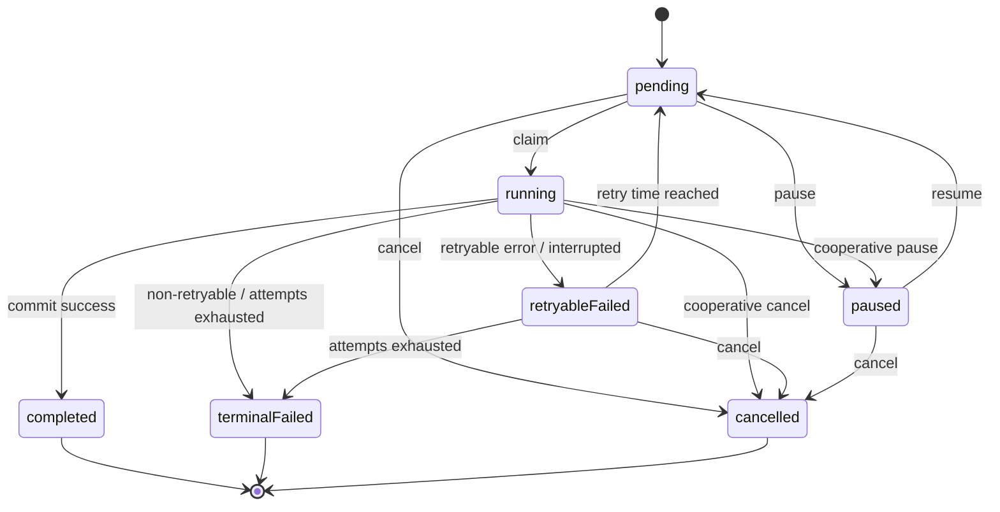

# ImageAll 阶段 0 实施规格

> 状态：Completed v1.0（Gate 0 与切片 1–6 已通过）<br>
> 日期：2026-07-15<br>
> 上位文档：[ARCHITECTURE.md](./ARCHITECTURE.md)<br>
> 目标读者：负责首轮实现和评审的 macOS 工程师

## 1. 阶段目标

阶段 0 只建立后续功能都依赖的工程与数据底座：

1. 一个能启动的原生 SwiftUI macOS App；
2. 一个可迁移、可快照、可验证恢复的 GRDB 目录库；
3. 一组不依赖 UI 和基础设施的核心领域规则；
4. 一个崩溃后可恢复的进程内持久化任务状态机；
5. 能证明上述契约的自动化测试与实施证据。

本阶段不接入文件夹、PhotoKit、缩略图、视觉特征、预测或正式产品界面。空壳应用只显示目录库是否成功启动；不能用占位实现伪装后续功能。

阶段 0 的核心结果不是“生成了一个 Xcode 工程”，而是后续阶段可以在不改变事实数据语义和任务恢复语义的前提下继续开发。

## 2. 当前实施基线

2026-07-15 完成 Gate 0、切片 1–6 及其复审修正后的实施基线：

| 项目 | 当前状态 | 对阶段 0 的影响 |
|---|---|---|
| 系统 | macOS 26.5.1，Apple Silicon | 首个本机验证环境已建立；Intel 仍未验证 |
| 工具链 | Xcode 26.6、Swift 6.3.3、macOS SDK 26.5 | Debug build 与测试已独立复核通过 |
| 工程配置 | macOS 15.0、Swift 6 language mode、本地 ad-hoc 签名、App Sandbox | Gate 0 与切片 1 基线已冻结 |
| 版本控制 | 本地 `main`；阶段 0 批准实现截至 `892f4e2`，工作区干净 | 阶段 1 必须从已批准历史另立交接单 |
| 已实现范围 | SwiftUI 空壳、Composition Root、纯 Domain 规则、GRDB v001 与最小 Catalog Repository、持久化 Job 状态机、目录库快照/安全恢复、AppPaths、进程锁与正式启动集成 | 阶段 0 闭环已完成；真实资产接入仍未开始 |
| 自动化基线 | 268 项测试通过，Debug build 通过 | 阶段 1 必须保持全部既有测试无回归 |

Gate 0 与切片 1–6 已由 Codex 复审通过，完整证据见 [STAGE-0-EVIDENCE.md](./STAGE-0-EVIDENCE.md)。后续实现不得重新解释 `foundationReady` 或放宽 `CatalogReady` 的数据库与恢复 gate。

## 3. 阶段边界与暂定决策

### 3.1 工程基线

- 标准 SwiftUI `App` 生命周期和 `WindowGroup`，不是 document-based app；
- 一个 macOS App target `ImageAll`；
- 一个单元/集成测试 target `ImageAllTests`；
- 不创建 UI Test target、XPC service、LaunchAgent 或额外 Swift Package；
- 使用 Swift Package Manager 引入 GRDB，不引入 `GRDBQuery` 或其他第三方库；
- App Sandbox 从第一天启用，阶段 0 不申请网络、Photos 或用户文件权限；
- 依赖只在 Composition Root 组装，SwiftUI 不直接打开数据库。

阶段 0 暂以 macOS 15.0、Apple Silicon 为开发基线。这是为了让工程可以开工，不是最终兼容性承诺；进入阶段 1 前必须决定是否支持 Intel，以及是否把最低版本调整到 macOS 14 或其他版本。分发方式暂用本地开发签名，Developer ID 与 Mac App Store 的选择不阻塞阶段 0。

截至 2026-07-14，[GRDB 官方 release](https://github.com/groue/GRDB.swift/releases/tag/v7.11.1) 最新版本为 7.11.1；GRDB 7.9 起要求 Swift 6.1 / Xcode 16.3 或更新版本，当前工具链满足要求。实现使用 `7.11.1..<8.0.0` 的明确语义版本范围并提交 Xcode 解析后的精确锁定结果，不依赖分支或浮动的 `main`。

### 3.2 目录与依赖边界

首批实现只创建实际有文件的目录，不为未来功能建立空层：

```text
ImageAll/
├── App/CompositionRoot/
├── Application/
│   ├── Ports/
│   └── Jobs/
├── Domain/
│   ├── Models/
│   └── Rules/
└── Infrastructure/
    ├── Database/
    └── JobQueue/

ImageAllTests/
├── Domain/
├── Database/
└── Jobs/
```

允许的编译期依赖为：

```text
App / Composition Root → Application + Infrastructure
Application            → Domain + Application Ports
Infrastructure         → Domain + Application Ports + GRDB
Domain                  → Swift 标准库 / Foundation 值类型
```

禁止 `Domain → GRDB`、`Application → 具体数据库类型`、`Infrastructure → SwiftUI`。阶段 0 不需要为每个目录拆 module；测试通过行为和评审依赖方向即可。

### 3.3 运行时存储位置

数据库和缓存路径必须由单一 `AppPaths` 端口提供，不能散落拼接：

- 事实库：Application Support 下的 `Catalog/ImageAll.sqlite`；
- 同机操作快照：Application Support 下的 `Backups/`；
- 可重建文件：Caches 下的对应应用目录；
- 测试：每个测试使用独立临时目录，不能接触真实用户容器或
  [`LOCAL-TEST-DATA-SAFETY.md`](./LOCAL-TEST-DATA-SAFETY.md) 定义的受保护真实照片来源。

具体容器根路径由系统 API 解析。正式 bundle identifier 不是本地创建工程的 Gate 0；未确认时使用明确的本地开发 identifier。它必须在切片 1 完成和首个共享基线提交前确认，临时 identifier 不得进入该基线。

## 4. 首个 migration 契约

迁移名使用不可变、有序且描述性的标识，例如 `v001_create_catalog_core`。一旦进入共享基线，不允许修改已发布 migration；任何变化追加新 migration。

### 4.1 v001 精确数据字典

首个 migration 只创建阶段 0 及阶段 1 事实闭环必需的六张表。模型、特征和预测表留到对应阶段再增加。

#### `source`

| 列 | SQLite 类型 | NULL / 默认 | 约束或含义 |
|---|---|---|---|
| `id` | TEXT | NOT NULL | PRIMARY KEY，规范 UUID |
| `kind` | TEXT | NOT NULL | CHECK 封闭词汇 |
| `display_name` | TEXT | NOT NULL | trim 后非空 |
| `bookmark` | BLOB | NULL | folder 必须非空；photos 必须为空 |
| `sync_cursor` | BLOB | NULL | 来源适配器的不透明游标 |
| `scan_generation` | INTEGER | NOT NULL / 0 | CHECK ≥ 0 |
| `dirty_epoch` | INTEGER | NOT NULL / 0 | CHECK ≥ 0 |
| `state` | TEXT | NOT NULL / `active` | CHECK 封闭词汇 |
| `created_at_ms` | INTEGER | NOT NULL | UTC Unix epoch milliseconds |
| `updated_at_ms` | INTEGER | NOT NULL | UTC Unix epoch milliseconds |

#### `asset`

| 列 | SQLite 类型 | NULL / 默认 | 约束或含义 |
|---|---|---|---|
| `id` | TEXT | NOT NULL | PRIMARY KEY，规范 UUID |
| `source_id` | TEXT | NOT NULL | FK `source.id` ON DELETE RESTRICT |
| `locator_kind` | TEXT | NOT NULL | CHECK 封闭词汇 |
| `relative_path` | TEXT | NULL | file 时非空且必须是规范相对路径 |
| `photos_local_identifier` | TEXT | NULL | photos 时非空 |
| `locator_state` | TEXT | NOT NULL / `current` | CHECK 封闭词汇 |
| `media_type` | TEXT | NOT NULL | 非空 UTI 字符串 |
| `width` | INTEGER | NULL | NULL 或 > 0 |
| `height` | INTEGER | NULL | NULL 或 > 0 |
| `media_created_at_ms` | INTEGER | NULL | 来源媒体时间 |
| `media_modified_at_ms` | INTEGER | NULL | 来源媒体时间 |
| `content_revision` | INTEGER | NOT NULL / 1 | CHECK ≥ 1 |
| `last_seen_generation` | INTEGER | NULL | NULL 或 ≥ 0 |
| `availability` | TEXT | NOT NULL / `available` | CHECK 封闭词汇 |
| `record_created_at_ms` | INTEGER | NOT NULL | 目录记录创建时间 |
| `record_updated_at_ms` | INTEGER | NOT NULL | 目录记录更新时间 |

locator CHECK 必须保证两种定位列恰有一个存在：file 只能有 `relative_path`，photos 只能有 `photos_local_identifier`。Source kind 与 locator kind 的跨表一致性由 Catalog Repository 在写事务中校验，并用集成测试证明。

#### `file_fingerprint`

| 列 | SQLite 类型 | NULL / 默认 | 约束或含义 |
|---|---|---|---|
| `asset_id` | TEXT | NOT NULL | PRIMARY KEY，FK `asset.id` ON DELETE CASCADE |
| `size_bytes` | INTEGER | NOT NULL | CHECK ≥ 0 |
| `modified_at_ns` | INTEGER | NOT NULL | 文件系统 mtime 的纳秒整数表示 |
| `resource_id` | BLOB | NULL | 文件系统返回的不透明标识 |
| `sha256` | BLOB | NULL | NULL 或恰好 32 bytes |

该表只能关联 `locator_kind = file` 的 Asset。SQLite 外键不能表达这条跨表约束，因此由 Catalog Repository 在同一事务校验，并必须有“Photos Asset 被拒绝写 fingerprint”的真实数据库集成测试。

#### `tag`

| 列 | SQLite 类型 | NULL / 默认 | 约束或含义 |
|---|---|---|---|
| `id` | TEXT | NOT NULL | PRIMARY KEY，规范 UUID |
| `name` | TEXT | NOT NULL | trim 后非空 |
| `normalized_name` | TEXT | NOT NULL | BINARY 比较，由命名唯一索引约束 |
| `state` | TEXT | NOT NULL / `active` | CHECK 封闭词汇 |
| `created_at_ms` | INTEGER | NOT NULL | UTC Unix epoch milliseconds |
| `updated_at_ms` | INTEGER | NOT NULL | UTC Unix epoch milliseconds |

#### `asset_tag_decision`

| 列 | SQLite 类型 | NULL / 默认 | 约束或含义 |
|---|---|---|---|
| `asset_id` | TEXT | NOT NULL | FK `asset.id` ON DELETE RESTRICT |
| `tag_id` | TEXT | NOT NULL | FK `tag.id` ON DELETE RESTRICT |
| `decision` | TEXT | NOT NULL | CHECK `accepted` / `rejected` |
| `updated_at_ms` | INTEGER | NOT NULL | UTC Unix epoch milliseconds |

PRIMARY KEY 为 `(asset_id, tag_id)`。

#### `job`

| 列 | SQLite 类型 | NULL / 默认 | 约束或含义 |
|---|---|---|---|
| `id` | TEXT | NOT NULL | PRIMARY KEY，规范 UUID |
| `kind` | TEXT | NOT NULL | 非空的版本化 discriminator |
| `payload_version` | INTEGER | NOT NULL | CHECK ≥ 1 |
| `payload` | BLOB | NOT NULL | handler 解码的不透明参数 |
| `source_id` | TEXT | NULL | FK `source.id` ON DELETE SET NULL |
| `coalescing_key` | TEXT | NULL | NULL 或非空 |
| `checkpoint_version` | INTEGER | NULL | 与 checkpoint 同时为空或存在，存在时 ≥ 1 |
| `checkpoint` | BLOB | NULL | 已提交进度的不透明数据 |
| `scan_generation` | INTEGER | NULL | NULL 或 ≥ 0 |
| `started_dirty_epoch` | INTEGER | NULL | NULL 或 ≥ 0 |
| `state` | TEXT | NOT NULL / `pending` | CHECK 封闭词汇 |
| `control_request` | TEXT | NOT NULL / `none` | CHECK 封闭词汇；非 running 时只能为 none |
| `priority` | INTEGER | NOT NULL / 0 | 数值越大优先级越高 |
| `attempts` | INTEGER | NOT NULL / 0 | CHECK 0 ≤ attempts ≤ max_attempts |
| `max_attempts` | INTEGER | NOT NULL | CHECK > 0 |
| `not_before_ms` | INTEGER | NOT NULL | 允许 claim 的最早时间 |
| `lease_owner` | TEXT | NULL | running 时必须非空 |
| `lease_expires_at_ms` | INTEGER | NULL | running 时必须非空；其他状态两项 lease 都为空 |
| `progress_completed` | INTEGER | NOT NULL / 0 | CHECK ≥ 0 |
| `progress_total` | INTEGER | NULL | NULL 或 ≥ progress_completed |
| `last_error_code` | TEXT | NULL | 结构化、非敏感错误码 |
| `last_error_message` | TEXT | NULL | 已脱敏诊断摘要 |
| `created_at_ms` | INTEGER | NOT NULL | UTC Unix epoch milliseconds |
| `updated_at_ms` | INTEGER | NOT NULL | UTC Unix epoch milliseconds |

通用存储规则：

- 六张业务表使用 SQLite `STRICT` table，使声明的 TEXT / INTEGER / BLOB 类型在写入时生效；GRDB 自己维护的 migration 表不受本项目控制；
- UUID 以小写 `8-4-4-4-12` 规范文本保存；
- 业务时间统一为 UTC Unix epoch milliseconds；
- 文件 mtime 单独保留可获得的最高稳定精度，不与业务时间字段混用；
- Bool 采用受 CHECK 约束的整数；
- 枚举以可读文本保存并受 CHECK 约束；
- 外键检查必须在每个连接上启用；
- 所有写入事务失败时整体回滚。

删除策略默认保护事实：`source → asset`、`asset/tag → asset_tag_decision` 使用 RESTRICT；`asset → file_fingerprint` 可以级联，因为 fingerprint 只是 Asset 的从属记录；Job 的可空 source 引用在来源永久清除后置空以保留任务审计。永久清除由显式应用用例按正确顺序完成，不能依赖一次级联删除。

v001 的封闭词汇必须统一，禁止各层自行发明同义值：

| 字段 | 允许值 |
|---|---|
| `source.kind` | `folder`, `photos` |
| `source.state` | `active`, `disabled`, `unavailable`, `authorizationRequired` |
| `asset.locator_kind` | `file`, `photos` |
| `asset.locator_state` | `current`, `historical` |
| `asset.availability` | `available`, `missing`, `unreadable`, `unsupported` |
| `tag.state` | `active`, `archived` |
| `asset_tag_decision.decision` | `accepted`, `rejected` |
| `job.state` | `pending`, `running`, `paused`, `retryableFailed`, `completed`, `terminalFailed`, `cancelled` |
| `job.control_request` | `none`, `pause`, `cancel` |

`job.kind` 是可扩展 discriminator，不做数据库 CHECK；payload 与 checkpoint 分别由明确的版本列约束。Job handler registry 负责校验。当前应用遇到未知 kind 或不支持的 payload/checkpoint version 时，先 claim，再把任务安全地转为 terminalFailed 并记录结构化错误码，不能崩溃或猜测执行。

### 4.2 locator 与身份约束

`asset_id` 是不可变身份，locator 只是当前定位。为了同时支持“来源离线”和“同一路径后来出现新文件”，`asset.locator_state` 与 `asset.availability` 必须分开：

- `locator_state = current`：该 locator 当前绑定此 Asset；
- `locator_state = historical`：保留历史事实，但不再占用当前 locator；
- Source 离线只改变 `source.state`，不释放 locator；
- 已完成扫描确认文件缺失时改变 availability，也不自动释放 locator；
- 同路径出现资源身份不同的新文件时，在同一事务内把旧 locator 设为 historical，再创建新 Asset；
- 每个 Source 内同一 locator 最多只有一个 current Asset，使用 partial unique index 保证。

这样既不会因拔盘制造重复 Asset，也不会把旧文件的人工标签继承给路径复用后的新文件。

### 4.3 阶段 0 索引

只建立已经对应明确查询或完整性需求的索引：

- `asset_current_file_locator_uq`：`(source_id, relative_path)`，仅覆盖 `locator_kind = file AND locator_state = current`；
- `asset_current_photos_locator_uq`：`(source_id, photos_local_identifier)`，仅覆盖 `locator_kind = photos AND locator_state = current`；
- `asset_source_availability_idx`：`(source_id, availability, id)`；
- `tag_normalized_name_uq`：`(normalized_name)`；
- `decision_tag_idx`：`(tag_id, decision, asset_id)`；
- `job_queue_idx`：`(state, priority DESC, not_before_ms, id)`；
- `job_active_coalescing_uq`：`(coalescing_key)`，仅覆盖非空 key 与活动状态。

coalescing 的活动状态集合固定为 `pending`、`running`、`paused`、`retryableFailed`；`completed`、`terminalFailed`、`cancelled` 不占用 key。

不在阶段 0 为预测、评分或全文搜索预建索引。

### 4.4 迁移与打开流程

独占调度锁是应用容器内锁文件上的 OS advisory lock，不是“文件存在即上锁”的哨兵文件。进程持有打开的文件描述符直至退出；正常退出或崩溃后由 OS 自动释放。未取得锁的实例不得打开正式数据库。

应用启动的数据流程固定为：

```text
解析容器路径 → 创建所需目录 → 取得独占调度锁
→ 检查数据库 schema → 必要时生成迁移前快照
→ 在临时工作副本执行 migration 与 quick_check
→ 成功后原子替换；失败则保持当前库不变
→ 打开正式数据库 → 恢复中断任务 → 发布 CatalogReady
```

全新空库可以直接在临时路径创建 v001、验证后发布，不需要迁移前快照。已有数据库若没有待执行 migration，则不制造副本；若有待执行 migration，必须先生成第 7 节的已验证快照，再从该一致性快照建立工作副本。migration 只在工作副本执行，全部成功且 quick check 通过后才关闭所有连接、处理 WAL/SHM sidecar 并原子替换正式库，因此单个或多个 migration 中途失败都不能改变原库。空间不足以同时容纳快照和工作副本时阻止升级并给出所需空间，不退化为原地冒险升级。

任何一步失败都进入明确的 `CatalogUnavailable` 状态并阻止任务调度；应用不得静默创建另一份空数据库。schema 版本高于当前应用时直接拒绝打开，不能尝试降级。

## 5. 核心领域规则

领域对象是带约束的值和状态，不是数据库 Record。阶段 0 至少固定以下规则：

### 5.1 Source 与 Asset

- ID 创建后不可变化；
- 停用 Source 只改变状态，不删除 Asset、标签决定或任务历史；
- `content_revision` 从 1 开始，只能递增；
- 内容 revision 变化只标记未来派生数据失效，不删除人工决定；
- 未完成 generation 不得把未见 Asset 标记为缺失；
- locator 变更必须遵守第 4.2 节，并由单个事务完成。

### 5.2 Tag 与人工决定

- 标签显示名去除首尾空白，空名称非法；
- normalized name 使用 Unicode NFC、内部空白折叠和与区域无关的大小写折叠；
- 同一 normalized name 只能有一个 Tag；
- 标签归档后不能接受新的批量应用，但已有决定保留；
- 同一 Asset/Tag 只有 accepted、rejected、unknown 三种业务含义；
- unknown 不落库，表示没有 `asset_tag_decision` 行；
- accepted 与 rejected 通过同一行替换，不能并存；
- 后续预测永远不能写入或覆盖该表。

标准化顺序固定为：Unicode NFC → 按 Unicode `White_Space` 属性 trim 并把连续空白折叠为一个 ASCII space → locale-independent default case fold → 再次 NFC。阶段 0 至少固定以下测试向量：

| 输入 | normalized name |
|---|---|
| `"  家人  "` | `"家人"` |
| `"Work\t  Reference"` | `"work reference"` |
| composed `"Café"` | `"café"` |
| decomposed `"Cafe◌́"` | `"café"` |

NFC 不执行宽度折叠或去重音；若产品以后要改变这项语义，必须新增 normalization version 和数据 migration，不能静默改变唯一性。

### 5.3 错误语义

领域错误必须可区分，不能只返回自由文本：至少包括非法名称、重复标签、非法状态迁移、revision 回退、locator 冲突和引用不存在。面向用户的本地化文案不进入领域层。

## 6. 持久化任务状态机

### 6.1 状态与转换



除图中转换外全部非法。`completed`、`terminalFailed`、`cancelled` 是终态，不能复活；需要重跑时创建新 Job。

### 6.2 调度契约

- claim 必须是原子事务：选择一个到期 pending Job、改为 running、写入 lease，并递增 attempts；
- 可运行 Job 按数值 priority 从高到低选择，同优先级再按 not-before 和 ID 稳定排序；
- attempts 表示实际开始过的次数，创建时为 0；
- 最大尝试次数由 job kind 策略给出并在创建时固化；
- checkpoint 只指向已经提交的工作；业务批次与 checkpoint 必须在同一数据库事务内提交；
- coalescing key 只阻止同一逻辑工作的多个活动 Job，不能阻止终态 Job 之后创建新一轮；
- pause/cancel 是协作式请求，handler 在安全批次边界提交状态；
- running Job 收到 pause/cancel 时先写 `control_request`，state 仍为 running；handler 提交当前安全批次后才把 state 改为 paused/cancelled 并清空请求；
- 控制请求是单调的：`none → pause → cancel`；cancel 优先于 pause，已写 cancel 后不能被 pause 或 none 覆盖；
- 日志和 `last_error` 不得包含完整路径、bookmark、Photos ID 或图片内容。

### 6.3 崩溃恢复

MVP 只允许一个任务调度进程。启动时必须先取得应用容器内的进程级独占调度锁；未取得锁的第二实例不得打开正式目录库，只显示“已有实例运行”并退出或等待。取得锁后，遗留 running Job 不可能仍有合法执行者：

1. `control_request = cancel` 的遗留 Job 转为 cancelled；
2. `control_request = pause` 的遗留 Job 转为 paused；
3. 其余 running Job 在事务中记为 `retryableFailed`，错误码为 `interrupted`，并清除 lease；
4. attempts 未耗尽的 Job 按策略设置 not-before，时间到后回到 pending；
5. attempts 已耗尽的 Job 转为 terminalFailed；
6. handler 依靠 checkpoint 幂等重放最后一个未提交批次。

阶段 0 使用可控时钟和假 handler 测试状态机，不接入真实文件扫描任务。

## 7. 数据库快照与恢复契约

阶段 0 必须建立操作恢复能力，因为后续所有不可重建事实都会依赖该库。

快照流程：

1. 使用 SQLite online backup API 从一致性读视图写入 `Backups/<id>.tmp/` 中的数据库文件；
2. 对目标库执行 `PRAGMA quick_check`；
3. 生成包含 schema version、创建时间、数据库校验和的 manifest；
4. 数据库与 manifest 都验证成功后，把整个临时目录原子重命名为 `Backups/<id>/`；
5. 失败时删除临时产物，不影响当前主库。

manifest 是 UTF-8 JSON，`format_version = 1`，至少包含 snapshot ID、创建时间、应用版本、已应用 migration ID 列表、数据库文件名、字节数和 SHA-256（小写十六进制）。数据库关闭后计算 SHA-256；manifest 中不保存 bookmark 明文。当前应用允许恢复 schema 与当前相同的快照，也允许把旧 schema 复制到工作副本后升级；包含未知未来 migration 的快照必须拒绝。

正式库使用 WAL journal mode。涉及正式数据库文件替换时必须先停止调度、checkpoint 并 truncate WAL、关闭全部连接，确认候选目录不存在 `-wal`/`-shm` 残留，再使用平台提供的带 backup item 原子替换；不能用“先删后移”。

恢复流程：

1. 停止调度并关闭所有数据库连接；
2. 验证候选快照、manifest、schema version 和校验和；
3. 从候选快照建立恢复工作副本；旧 schema 只在该工作副本迁移，随后执行 quick check；
4. 把当前故障库保留为带时间戳的副本；
5. 以带 backup item 的原子操作把已验证工作副本替换为正式库，再重新打开并执行 quick check，不在正式路径执行 migration；
6. 替换或重新打开后的验证失败时，把失败候选移入 quarantine，并用 backup item 或已验证的操作前快照恢复原活动库；
7. 任一步失败都保留现状和诊断信息，不创建空库。

Stage 0 测试只需要验证手动快照、迁移前快照入口和恢复；“事实变化后每天至多一次、保留最近三份”的调度策略可以到第一个事实写入用例接入时启用，但接口契约不得改变。

## 8. TDD 实施顺序

实现者应按下列顺序提交可独立评审的纵向切片。每一步先出现能失败的测试，再写最少实现使其通过。

| 顺序 | 实施切片 | 先验证的失败行为 | 完成证据 |
|---:|---|---|---|
| 0 | 工具链与 Git 基线 | `xcodebuild` 或干净基线不可证明 | 版本记录、干净状态 |
| 1 | SwiftUI 空壳与 Composition Root | App target 尚不能构建/启动 | Debug build、启动截图或日志 |
| 2 | Domain 规则 | 非法标签、冲突决定、revision 回退未被拒绝 | Domain 测试全绿 |
| 3 | GRDB v001 | 空库、重开、约束和回滚行为未定义 | Database 测试全绿、schema dump |
| 4 | Job 状态机 | 非法转换、重复 claim、崩溃恢复未被拒绝 | Jobs 测试全绿 |
| 5 | 快照与恢复 | 半快照、坏 manifest、恢复失败可能覆盖主库 | Backup/restore 测试全绿 |
| 6 | 启动集成 | migration/恢复失败时仍可能启动调度 | 全套测试与手工 smoke evidence |

不得为了让测试通过而放宽本规格的数据库约束。若实现证明某条约束不可行，先提交 ADR 变更，再改测试和实现。

## 9. 验收矩阵

### 9.1 工程

- Debug build 在记录的本机环境成功；
- App Sandbox 已启用，阶段 0 无多余 entitlement；
- App 启动后只在自己的容器创建目录库；
- UI 主线程不执行 migration、backup 或恢复 I/O；
- 依赖锁定结果进入版本控制。

### 9.2 领域

- accepted/rejected 互斥，unknown 不落库；
- 标签标准化和唯一性在领域与数据库两层一致；
- content revision 不能回退；
- Source 停用不会级联删除事实；
- locator 路径复用不会继承旧 Asset 身份。

### 9.3 数据库

- 全新临时目录可以创建 v001；
- 重开数据库不会重复执行 migration；
- 外键、CHECK、唯一和 partial unique 约束有反例测试；
- 事务中途失败不留下半批数据；
- 测试能检查实际 schema，而不只 mock repository；
- schema 版本高于当前应用时明确拒绝打开。
- 两个 locator partial unique index 分别拒绝重复的 current file/photos locator，同时允许任意数量 historical 记录；
- `file_fingerprint` Repository 拒绝 Photos Asset。

### 9.4 任务

- 所有合法转换成功，所有非法转换失败且不改变记录；
- 两个并发 claim 不能得到同一 Job；
- 活动 coalescing key 不重复，终态后可创建新 Job；
- checkpoint 与模拟业务写入同成同败；
- 遗留 running Job 按 attempts 恢复或终止；
- pause/cancel 不回滚已经提交的批次；
- pause 后到达的 cancel 必须获胜；带已持久化 pause/cancel 请求的 running Job 崩溃后分别恢复为 paused/cancelled；
- 未知 job kind 或不支持的 payload/checkpoint version 只能产生结构化 terminal failure；
- 第二进程持锁期间不能打开正式目录库、claim 或恢复 Job；持锁进程退出或被终止后，另一进程才能取得锁并安全恢复。

### 9.5 快照与恢复

- 快照期间发生并发读取/写入时，产物仍是可打开的一致数据库；
- 临时或校验失败的快照不会出现在可恢复列表；
- 坏快照、坏 manifest 和错误 schema version 都被拒绝；
- 成功恢复后人工决定等事实完全一致；
- 原故障库仍被保留，可供诊断；
- 原子替换后的重新打开或 quick check 失败时，测试证明原活动库自动回滚，且 WAL/SHM 不会混入候选库。

## 10. 阶段完成定义

阶段 0 只有满足以下全部条件才能从“Ready for implementation”改为“Completed”：

- Gate 0 通过；
- 第 8 节切片 1–6 完成并被评审；
- 第 9 节所有自动化与人工检查通过；
- 实现没有引入本阶段非目标；
- `docs/STAGE-0-EVIDENCE.md` 记录工具链版本、构建命令、测试命令、结果摘要、schema dump、已知限制和对应 commit；
- 总架构中的阶段 0 状态和任何受影响 ADR 已同步更新。

当前状态是：**Completed；Gate 0 与切片 1–6 均已通过，阶段 0 批准实现为 `892f4e2`。阶段 1 尚未开始。**

## 11. 需要项目所有者确认但不阻塞规格的事项

1. 暂定最低 macOS 15.0 是否接受；
2. 是否明确放弃 Intel，还是在阶段 1 前加入 Intel 构建/运行验证；
3. 正式 bundle identifier（不阻塞本地建工程，但阻塞切片 1 完成和首个共享基线）；
4. 最终分发方式：仅自用、Developer ID，或 Mac App Store。

如果这些选择在实现开始前仍未确认，开发者只能使用本地临时配置，不得把它们当作正式产品承诺。

## 12. 资料依据

- [Apple: SwiftUI App](https://developer.apple.com/documentation/swiftui/app)
- [Apple: Configuring the macOS App Sandbox](https://developer.apple.com/documentation/xcode/configuring-the-macos-app-sandbox)
- [Apple: Accessing files from the macOS App Sandbox](https://developer.apple.com/documentation/security/accessing-files-from-the-macos-app-sandbox)
- [GRDB.swift](https://github.com/groue/GRDB.swift)
- [SQLite: STRICT Tables](https://www.sqlite.org/stricttables.html)
- [SQLite: Online Backup API](https://www.sqlite.org/backup.html)
