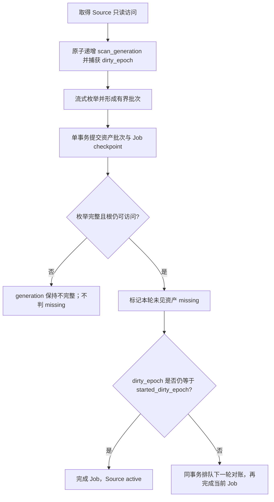

# ImageAll 阶段 1 后端资产闭环架构

> 状态：Approved — 后端边界与阶段 1 产品基线已批准，可按独立交接单实施 
> 日期：2026-07-15 
> 基线：`main@2a7819e1bcf17f424f7c8b05484cb1897e6c3aa6` 
> 角色边界：本文由 Codex 以产品经理/资深架构师身份维护，不是 Cursor 实施交接单

## 1. 本轮结论与停止位置

阶段 1 仍采用“文件夹资产闭环”方向，但必须拆成两个设计面：

1. **后端资产面**：只读目录授权、来源恢复、流式扫描、generation 对账、FSEvents dirty trigger、元数据与缩略图缓存契约；
2. **产品界面面**：来源管理、首次使用流程、照片浏览结构、网格外观、选择与标签交互、筛选语义和错误呈现。

第二个设计面已形成并批准为独立的
[`STAGE-1-PRODUCT-UI-SPEC.md`](./STAGE-1-PRODUCT-UI-SPEC.md)。本文与该产品规格共同构成阶段 1 的批准输入；具体代码范围必须继续由自包含实施规格和逐切片 Cursor 交接单授权，不得从架构描述推导额外实现。

无论进入哪个切片，都不得访问 `/Volumes/HDD2` 的受保护真实照片。自动化只使用测试创建的临时 fixture；真实目录 smoke 仍需当次专项授权。

## 2. 目标与非目标

### 2.1 后端目标

阶段 1 后端完成后，应具备以下能力：

- 记录一个由用户明确授权的只读文件夹 Source；
- 重启后用 app-scoped security-scoped bookmark 恢复访问；
- 在外置盘拔出、权限失效或 bookmark 过期时保留目录事实，不误判批量删除；
- 流式枚举大目录，以有界批次更新 Asset 与 fingerprint；
- 只有完整 generation 才把本轮未见资产标记为 `missing`；
- 目录变化只触发重新对账，FSEvents 事件本身不直接生成 Asset 事实；
- 只为新增或内容变化的支持图片生成派生元数据/缩略图；
- 所有派生文件只写入应用 Caches，受配额与磁盘安全余量约束；
- 原始来源全程只读，日志和证据不包含完整路径或图片内容。

### 2.2 本文不设计的内容

- Apple Photos / PhotoKit、iCloud 下载与 Photos 权限；
- RAW、Live Photo、视频、PDF、OCR、embedding、模型和预测；
- 删除、移动、重命名、覆盖、去重或原地编辑来源文件；
- XMP/JSON sidecar；
- 跨来源资产合并；
- 应用退出后继续运行的 XPC、LaunchAgent 或 daemon；
- 来源管理界面、照片网格、详情页、标签编辑器、筛选器和视觉规范。

## 3. 继承且不得重新解释的约束

本文继承以下已批准事实：

- 阶段 0 批准实现为 `892f4e2`，268 项测试与安全启动 gate 已通过；
- v001 migration 已发布且不可原地修改；任何 schema 变化只能追加 migration；
- `asset_id` 是不可变身份，locator 只是当前定位；
- Source 离线不释放 current locator；
- 人工标签事实不得被扫描或模型覆盖；
- 中断 generation 不得据此标记资产缺失；
- 文件夹和 Photos 最终都实现统一 `AssetSource` 边界，但阶段 1 只实现 folder；
- 原图只读，目录库位于 Application Support，派生数据位于 Caches；
- 自动化测试只使用独立临时 fixture；真实数据规则以
  [`LOCAL-TEST-DATA-SAFETY.md`](./LOCAL-TEST-DATA-SAFETY.md) 为准。

## 4. macOS 权限与平台契约

### 4.1 entitlement 最小增量与当前状态

阶段 1 交付时在现有 App Sandbox 之外只新增：

| entitlement | 用途 |
|---|---|
| `com.apple.security.files.user-selected.read-only` | 允许读取用户在系统面板中选择的文件夹 |
| `com.apple.security.files.bookmarks.app-scope` | 允许创建并解析跨启动的 app-scoped bookmark |

这是阶段 1 当时的切片边界，不是当前签名产物的完整描述。阶段 4 的可移植用户数据导出需要向用户在
系统面板中选择的父目录写入数据包，因此生产 target 现已把 app-wide user-selected entitlement 改为
`com.apple.security.files.user-selected.read-write`；macOS 不为同一 target 分别授予“来源选择只读”和
“导出选择读写”两套 user-selected entitlement。该变更不改变来源访问契约：文件夹来源仍只生成带
`.securityScopeAllowOnlyReadAccess` 的 app-scoped bookmark，且每次解析后只读访问；导出选择得到的
写 scope 只在本次导出期间使用，不持久化 bookmark。导出前还必须对全部已记录文件夹来源执行隔离
预检：目标与任一来源相同、位于来源内或包含来源时拒绝，关系无法确认时也拒绝。

除上述可移植导出所需能力和阶段 2 已批准的 Photos 读取能力外，仍不得新增全盘访问、Pictures 全目录
权限、网络、Automation、App Group 或其他无关能力。Apple 将 `user-selected.read-only` 定义为只读访问
用户在 Open/Save dialog 中选择的文件；app-scoped bookmark entitlement 用于持久访问安全作用域资源：

- [Apple: user-selected read-only entitlement](https://developer.apple.com/documentation/BundleResources/Entitlements/com.apple.security.files.user-selected.read-only)
- [Apple: user-selected read-write entitlement](https://developer.apple.com/documentation/BundleResources/Entitlements/com.apple.security.files.user-selected.read-write)
- [Apple: Enabling Security-Scoped Bookmark and URL Access](https://developer.apple.com/documentation/professional-video-applications/enabling-security-scoped-bookmark-and-url-access)
- [Apple: Accessing files from the macOS App Sandbox](https://developer.apple.com/documentation/Security/accessing-files-from-the-macos-app-sandbox)

签名产物必须用 `codesign` 复核实际 entitlement；项目声明、Debug 工具链注入和最终签名证据要分开报告。

### 4.2 bookmark 生命周期

授权适配器遵守以下顺序：

1. 从产品界面层接收系统目录选择器返回的 URL；Application/Domain 不导入 AppKit；
2. 验证根对象是可读目录，不是文件、符号链接、Finder alias、package 或 `.photoslibrary`；
3. 生成带 `withSecurityScope` 与只读选项的 app-scoped bookmark；
4. bookmark 创建成功、来源不重叠验证通过后，才把 Source 与初始扫描 Job 原子写入目录库；
5. 后续访问以 `withSecurityScope` 解析 bookmark，并优先避免 UI 与自动挂载副作用；
6. 若 bookmark 标记 stale，只有新 bookmark 成功生成后才替换数据库中的旧 BLOB；
7. 每次成功 `startAccessingSecurityScopedResource()` 都必须与一次 `stopAccessingSecurityScopedResource()` 配对；
8. 不把从 security-scoped URL 提取的字符串路径当作权限凭证，也不把完整路径写入日志或 Job payload。

Apple 明确要求成功开始访问后成对停止，否则会泄漏内核资源并最终导致沙盒无法再取得文件访问能力：

- [Apple: startAccessingSecurityScopedResource](https://developer.apple.com/documentation/Foundation/URL/startAccessingSecurityScopedResource%28%29)

扫描处理器每次执行持有一个有界 access session；FSEvents watcher 如需持续持有 scope，则一个活跃 Source 最多持有一个长期 session，并在 watcher 停止、Source 禁用或 App 退出时释放。所有测试必须能观测 start/stop 计数相等。

### 4.3 隐私清单

阶段 1 会读取用户授权文件的时间戳和大小，并查询应用缓存卷的可用空间。实施前必须对生产 target 的实际 API 做一次隐私清单审计，至少覆盖：

| API 类别 | 当前用途 | 预期 approved reason |
|---|---|---|
| `NSPrivacyAccessedAPICategoryFileTimestamp` | 对账用户明确授权目录中的文件元数据 | `3B52.1` |
| `NSPrivacyAccessedAPICategoryDiskSpace` | 写缩略图前阻止低空间写入并产生可观察状态 | `E174.1` |
| `NSPrivacyAccessedAPICategoryUserDefaults` | 仅当缓存配额确实存于 app 自有 UserDefaults | `CA92.1`，否则不声明 |

最终清单只声明实际调用的类别，不为了“以后可能使用”提前扩张。Apple 要求每个使用 required-reason API 的 bundle 在 `PrivacyInfo.xcprivacy` 中声明准确原因：

- [Apple: Describing use of required reason API](https://developer.apple.com/documentation/BundleResources/describing-use-of-required-reason-api)
- [Apple: Privacy manifest files](https://developer.apple.com/documentation/bundleresources/privacy-manifest-files)

## 5. 来源访问与生命周期

### 5.1 Source 状态映射

| 观察结果 | Source 状态 | 后端动作 |
|---|---|---|
| bookmark 可解析、scope 可取得、根目录可读 | `active` | 建立 watcher，排队对账 |
| 外置卷未挂载或根目录暂时不存在 | `unavailable` | 停止 watcher，暂停相关 Job，保留 locator |
| bookmark 无法解析、scope 被拒绝或 stale bookmark 无法更新 | `authorizationRequired` | 停止访问，等待重新授权 |
| 用户明确停用来源 | `disabled` | 停止 watcher与新任务，不删除 Source/Asset |

任何非 active 状态都不能释放 current locator，不能把全部资产标记为 missing，也不能清除人工标签。

### 5.2 根目录验证

新增来源时必须：

- 拒绝文件、符号链接、Finder alias、package 和 `.photoslibrary` 根；
- 拒绝与已有 folder Source 相同、互为祖先或互为后代的根；
- 不用名称或路径字符串猜测文件身份；比较只在已取得访问权限的解析 URL 上完成；
- 若某个已有 Source 暂时无法解析，因而不能证明“不重叠”，本次新增保守失败，而不是绕过检查；
- 不持久化绝对根路径。display name 只用于展示，不能作为身份。

创建 bookmark 时可以嵌入根资源标识符和卷标识符作为同机重连提示，但这些值是 opaque、best-effort 的本地信息，不得承诺跨卷、跨设备或系统恢复后的稳定性。重新授权只有在稳定身份唯一匹配时才自动保留原 `source_id`；无法证明时不得自动继承原 Source 的资产和标签。

重新授权中“无法自动证明，但用户希望确认它就是原目录”的产品行为属于第 14 节界面讨论范围，本轮不决定。

## 6. 目录枚举边界

Foundation 的深度 enumerator 支持预取 resource values，并明确不会递归跟随枚举过程中遇到的符号链接；`skipsPackageDescendants` 可把 package 当作文件而不进入内部：

- [Apple: FileManager deep directory enumerator](https://developer.apple.com/documentation/foundation/filemanager/enumerator%28at%3AincludingPropertiesForKeys%3Aoptions%3AerrorHandler%3A%29)
- [Apple: skipsPackageDescendants](https://developer.apple.com/documentation/foundation/filemanager/directoryenumerationoptions/skipspackagedescendants)

ImageAll 还必须施加更严格的产品边界：

- 流式递归，不调用会一次返回完整子树列表的 API；
- 默认跳过隐藏项、所有 package descendants、符号链接和 Finder alias；
- 无条件识别并跳过任何 `.photoslibrary` descendants，即使系统没有把它报告为 package；
- 只处理 regular file；目录、socket、device、FIFO 等不进入目录库；
- 不跟随来源内部指向其他位置的链接；
- 相对路径必须是根目录下的规范、非空、非绝对路径，不能含 `.`、`..`、NUL 或逃逸根目录；
- 硬链接按不同相对路径记录为不同 Asset；
- 单个子目录枚举错误会使整个 generation 不完整，不能在该轮执行 missing 判定；
- 单文件格式或解码错误只影响该 Asset，不阻止其他文件被看见。

## 7. 媒体识别与低成本元数据

### 7.1 分类规则

扩展名只能用作低成本候选过滤，不能作为最终媒体事实。最终类型由 Uniform Type Identifier 与 Image I/O 实际能力共同确认。Image I/O 能从 URL 读取图片、提取属性、查询运行时支持的 source type，并生成缩略图：

- [Apple: CGImageSource](https://developer.apple.com/documentation/imageio/cgimagesource)
- [Apple: Image I/O](https://developer.apple.com/documentation/imageio)

分类结果固定为：

| 文件结果 | 目录库行为 |
|---|---|
| 非图片 regular file | 忽略，不创建 Asset |
| 产品允许且 Image I/O 可读取的静态图片 | 创建/更新 Asset，`available` |
| 可识别为图片但产品明确排除的格式 | 创建/更新 Asset，`unsupported` |
| 声称是支持图片但容器或属性无法读取 | 创建/更新 Asset，`unreadable` |

按 ADR-041，批准清单在 JPEG、PNG、HEIC/HEIF、TIFF、WebP 基础上纳入 camera-raw（含富士/Adobe）、JPEG 2000 与静态 GIF；解码级联为 Image I/O → Core Image RAW → LibRaw。动画 GIF、非 RAW 多帧、SVG、Illustrator AI、PDF、视频和 Live Photo 视频轨仍不进入 `available`。

### 7.2 首轮元数据

首次扫描只读取：

- 规范 media UTI；
- 像素宽高（按方向转换后的逻辑尺寸）；
- 文件大小；
- 文件系统修改时间的最高稳定精度；
- best-effort opaque file resource identifier；
- 可无歧义转换为 UTC 时的媒体创建时间。

不默认读取完整 EXIF/XMP，不计算全库 SHA-256，不做颜色分析、OCR 或模型推理。无时区的拍摄时间不能静默按当前 Mac 时区解释；在没有单独的原始时间字段前，宁可让 `media_created_at_ms` 为空。

## 8. 资产身份与 revision

### 8.1 同一路径

- 已存和本次 resource identifier 都存在且相等：保留 `asset_id`；快速 fingerprint 变化时增加 `content_revision`；
- identifier 都不可用，但 current locator 从未进入 missing，且是连续对账中的同一路径：保留 `asset_id`；快速 fingerprint 变化视为同一资产内容 revision；
- identifier 明确不同，或该 locator 曾被完整 generation 判定 missing 后重新出现：旧 locator 转 historical，创建新 Asset，不继承标签；
- 信息互相矛盾：不自动合并，保留旧事实并记录结构化冲突。

### 8.2 移动重连

同一 Source 内只有以下情况可以自动把新路径重连到旧 `asset_id`：

1. 旧路径在当前完整 generation 未见；
2. 新路径与某个旧 Asset 的非空 resource identifier 唯一匹配；或
3. 在明确的歧义消解任务中，SHA-256 唯一匹配。

多个候选、跨 Source 命中或只有大小/mtime 相同都不能自动移动重连。resource identifier 只在本机当前来源上下文中使用，不能进入可移植身份承诺。

### 8.3 读取稳定性

生成缩略图前后分别读取 size、mtime 与可用的 resource identifier。如果前后不一致：

- 丢弃本次临时派生文件；
- 不发布 cache entry；
- 不推进完成进度；
- 以安全错误码重新排队该 Asset。

这能避免把扫描期间被替换的字节错误关联到旧 revision。

## 9. generation 对账与持久化 Job

### 9.1 Job 契约

首个真实 Job kind 计划为 `folder.reconcile.v1`：

- payload 只包含 `source_id` 和契约版本，不包含 bookmark 或路径；
- `source_id` 同时写入 Job 的结构化列；
- coalescing key 由固定前缀与 source UUID 构成；
- checkpoint 记录 generation 与聚合计数，不承诺可持久恢复 FileManager enumerator 游标；
- 崩溃或 lease 中断后，从头重跑同一 generation，依靠唯一约束与幂等 upsert 收敛。

### 9.2 阶段 0 Job seam 的已知缺口

当前 `JobHandler.execute` 只返回最终 checkpoint，`JobQueue.submitSafeBatch` 只更新 Job 行。它不能证明以下阶段 1 原子性：

> 一批 Asset/fingerprint/`last_seen_generation` 与该批 Job checkpoint 必须在同一个 SQLite 事务提交。

阶段 1 必须新增一个 Application 层扫描批次提交端口，由 GRDB infrastructure 在单个写事务中完成：

- 验证当前 lease 仍有效；
- 幂等写入 Asset 与 fingerprint；
- 更新 `last_seen_generation`；
- 更新 Job checkpoint、progress 与 lease；
- 在同一事务读取 pause/cancel control request，并只在安全批次边界响应。

Job execution 契约还必须做最小扩展，让扫描 handler 获得 lease-bound execution context；只传 payload/checkpoint 而不传 lease 身份，无法安全提交中间批次。具体 API 形状留给正式交接单，但 Application 层仍不得暴露 GRDB 类型。

不得用“先提交 Asset，再单独提交 checkpoint”或反向顺序替代。Application 端口不暴露 GRDB 类型；通用 Job 语义继续留在 `Application/Jobs`。

### 9.3 generation 流程

建议生产默认批次上限为 256 个候选记录，同时允许测试注入更小批次来覆盖崩溃边界；实际值必须通过内存与 SQLite 基准验证后才能成为性能承诺。

### 9.4 最终提交原子性

完整 generation 的最终事务必须一起完成：

- 确认 lease 与 generation 仍属于当前 Job；
- 标记 `last_seen_generation < currentGeneration` 的 current Asset 为 `missing`；
- 保留其 locator 为 current；
- 根据 dirty epoch 决定是否排队 successor Job；
- 更新 Source 状态；
- 把当前 Job 转为 completed。

若最终事务失败，以上动作全部回滚。对账中的局部数据库失败不能留下“资产已判缺失但 Job 仍未完成”的半事实。

## 10. FSEvents 只作 dirty trigger

阶段 1 不把 FSEvents path/event 直接转换为 Asset 创建、修改、移动或删除。Apple 明确说明某些事件只表示必须递归重扫；事件丢失、ID wrap 或 daemon 通信错误也要求完整扫描：

- [Apple: Using the File System Events API](https://developer.apple.com/library/archive/documentation/Darwin/Conceptual/FSEvents_ProgGuide/UsingtheFSEventsFramework/UsingtheFSEventsFramework.html)
- [Apple: FSEventStream event flags](https://developer.apple.com/documentation/coreservices/file_system_events/1455361-fseventstreameventflags)

MVP watcher 契约：

- App 每次启动都为 active Source 建立新 stream，并立即排队一次对账；正确性不依赖跨启动 event ID；
- watcher 必须先建立，再启动本轮 generation，以覆盖扫描期间的新变化；
- 回调批次只递增 `dirty_epoch`、合并排队 reconcile Job，并记录聚合 flag；
- 不持久化或记录事件完整路径；
- `MustScanSubDirs`、dropped、event ID wrap 都统一视为“需要完整对账”；
- root changed、unmount 或根不可访问时停止 watcher，把 Source 转为 `unavailable`，但不判定资产 missing；
- 同一回调批次可在一个事务中按事件数量推进 epoch，避免每个 path 单独写库；
- App 从不向来源写文件，因此 FSEvents 不承担“忽略自身写入后仍维持事实”的复杂逻辑。

此设计有意放弃“根据事件精确增量修改数据库”，换取丢事件、离线和并发变化下仍能最终收敛。

## 11. 缩略图与缓存后端边界

Image I/O 提供按最大像素尺寸创建、方向变换的缩略图能力：

- [Apple: CGImageSourceCreateThumbnailAtIndex](https://developer.apple.com/documentation/imageio/cgimagesourcecreatethumbnailatindex%28_%3A_%3A_%3A%29)

无论界面最终采用何种网格，缓存后端必须满足：

- cache key 至少包含 `asset_id`、`content_revision`、representation version 与 variant；
- 临时文件只能写入 App Caches；完整写入、解码校验成功后才能原子发布；
- 崩溃可产生未引用孤儿文件，但不能产生指向半文件的已发布 entry；
- 缓存缺失或损坏只触发重建，不改变 Asset 事实；
- 写入前执行 20 GiB 用户配额和 `max(5 GiB, 目标卷容量 5%)` 安全余量检查；
- 可用空间不足时停止新的派生写入，不删除事实库、快照或用户原图；
- 交互式网格/Inspector 请求可显式允许内存降级：来源与指纹校验、解码和缩放成功后直接返回临时 payload，不创建 cache entry、object 或 staging；未显式允许的请求继续返回结构化空间不足；
- 可用空间 API 的使用必须与第 4.3 节隐私清单一致；
- 淘汰只作用于 ImageAll 自己的 Caches 根，且不能越过规范路径安全检查。

缩略图 variant 已冻结为 256×256 方形 `gridSmall`、512×512 方形 `gridRegular` 与最大边 2048 px 的保比例 `preview`。缓存表与索引仍由相应实施切片的追加 migration 精确定义，不得修改 v001，也不得在首个查询切片提前加入缓存 schema。

## 12. migration 与索引方向

`v001_create_catalog_core` 保持完全不变。阶段 1 的追加 migration、查询端口和 cache-entry schema 由正式实施规格按最早使用切片冻结；已发布 migration 不得原地修改。

后端扫描已经能证明需要评估以下索引：

- `(source_id, last_seen_generation, id)`：generation 最终 missing 查询；
- `file_fingerprint(resource_id)` 的 non-null partial index：同来源唯一移动候选；
- `file_fingerprint(sha256)` 的 non-null partial index：按需 hash 歧义消解。

照片网格排序索引进入阶段 1 首个持久化切片；thumbnail cache-entry 表延后到缩略图切片。不得因为本文列出候选就让 Cursor 自行选择 schema；交接单必须给出精确 migration、查询证据与反例矩阵。

## 13. 后端验收矩阵

### 13.1 单元/契约测试

- bookmark start/stop 严格配对，错误路径也释放；
- stale bookmark 只有在刷新成功后替换；
- Source 状态转换不释放 locator；
- 相对路径拒绝绝对路径、`.`、`..`、NUL 与根逃逸；
- package、`.photoslibrary`、symlink、alias、特殊文件分类；
- 同路径 resource ID 相同/不同/缺失/冲突的身份规则；
- missing 后同路径重现创建新 Asset；
- 多候选 resource ID/SHA 不自动合并；
- 不完整 generation 永不判 missing；
- dirty epoch 在扫描中变化时必须产生 successor Job；
- Job payload/checkpoint 版本和安全错误码是封闭、可测试契约；
- cache key 随 content revision 与 representation version 变化；
- 低空间时拒绝派生写入但允许事实事务。

### 13.2 临时文件数据库集成测试

- 添加 Source、bookmark 与初始 reconcile Job 原子提交；
- 首扫、无变化重扫、内容变化、完整删除、缺失后重现；
- Asset 批次与 checkpoint 任一 SQL 失败时整体回滚；
- 最终 missing 与 Job completion 任一失败时整体回滚；
- 中途崩溃后从头重跑同一 generation 幂等；
- pause/cancel 只在批次边界生效；
- lease 失效的 handler 不能继续提交资产；
- 扫描期间注入 dirty event，不丢 successor；
- dropped/rootChanged/unmount flag 只触发重扫或不可用状态；
- 临时 fixture 中的 package、假 `.photoslibrary`、symlink、alias、硬链接与重叠根；
- 小型合法格式 fixture、伪扩展名、损坏文件和运行时不支持格式；
- 解码期间替换测试文件时临时缩略图不发布；
- 原子缓存发布、孤儿清理、损坏重建、配额和路径越界拒绝。

### 13.3 安全与人工 smoke

阶段 1 自动化测试不得访问 `/Volumes/HDD2`。受保护年份目录只能在以下条件全部满足后做人工只读 smoke：

1. 来源选择界面和阶段 1 实现已通过合成 fixture 验收；
2. 当次交接单明确授权真实目录 smoke；
3. 用户通过系统目录选择器亲自选择；
4. 静态检查证明生产代码不存在源端写 API；
5. 运行期源端写操作计数为零；
6. 只报告聚合数量、耗时和安全错误码；
7. 不做全量 hash，不记录逐项路径；
8. 验收前后证明来源内没有由 ImageAll 产生的新文件、重命名、移动或删除。

当前 `/Volumes/HDD2/Photos Library.photoslibrary` 仍完全属于阶段 2 PhotoKit 范围，阶段 1 不得读取或遍历其 package。

### 13.4 安全错误码族

实施规格至少应冻结以下非敏感错误语义，最终 raw value 在交接单中精确定义：

- bookmark 无效或刷新失败；
- security scope 被拒绝；
- 来源暂时不可用；
- 根对象无效或来源重叠；
- 枚举不完整；
- 单资产不可读或格式不支持；
- 读取期间资源变化；
- stale lease；
- 缓存容量不足、发布失败或 cache key 损坏。

`last_error_message` 不能包含完整路径、bookmark、图片内容或文件名列表。

## 14. 产品确认门结论

项目所有者于 2026-07-15 批准 `UI-001` 至 `UI-011`，并冻结以下实现输入：

- 默认进入统一“全部照片”，Sidebar 不展开完整目录树；
- 可折叠三栏工作台、方形网格、完整比例详情和 Inspector 标签主工作面；
- 标签三态、ALL/ANY 筛选、稳定 keyset 排序和可观察活动状态；
- 256、512 与最大边 2048 px 三类缓存表示；
- macOS 15+、Apple Silicon only；
- JPEG、PNG、HEIC/HEIF、TIFF、WebP；
- 阶段 1 继续本地开发/自用签名。

该确认门已关闭。实现必须按 [`STAGE-1-IMPLEMENTATION-SPEC.md`](./STAGE-1-IMPLEMENTATION-SPEC.md) 分切片推进；未在交接单授权的 UI、Photos、AI、自动化、发布或真实数据 smoke 仍不得提前实施。
